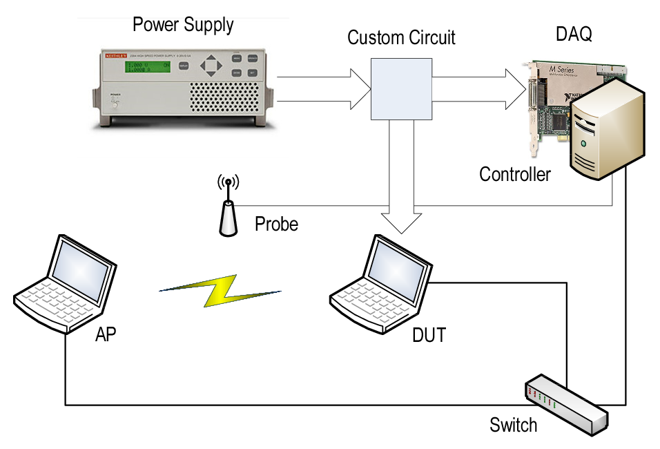
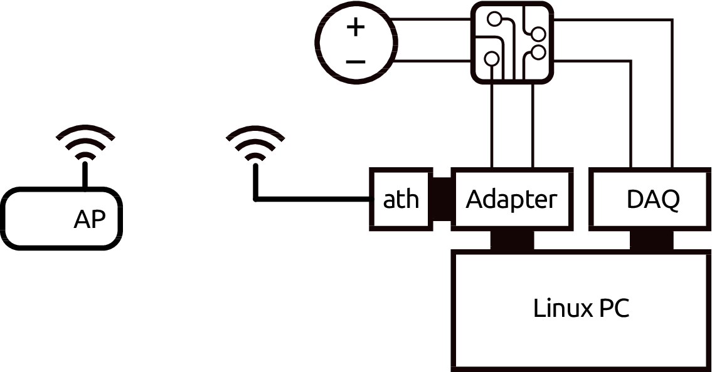

\addtocontents{toc}{\partseparator}

# (PART) Experimentation {-}

# A Comprehensive Energy Measurement Framework {#ch:03}

`r tufte::newthought("Energy measurements")` are typically conducted in an *ad-hoc* manner, with hardware and software tools specifically designed for a particular use case, and thus for limited electrical specifications. In this thesis, we are interested in measuring from small hardware components, such as wireless interfaces, to *energy debugging*`r margincite("Pathak2011")`, which implies whole-device mesurements. At the same time, potential wireless devices range from wearables and smartphones to access points and laptop computers. As a result, a flexible and reusable energy measurement framework for wireless communications must be able to cover a wide spectrum of electrical specifications (current, voltage and power) without losing accuracy or precision.

The main specifications for our framework are the following:

- High-accuracy, high-precision; in the range of mW.
- Avoid losing information between sampling periods, with events (transmission and reception of wireless frames) that last tens of microseconds.
- Support for a wide range of devices, from low- to high-powered devices, while keeping accuracy and precision.
- Support for synchronous measurements of multiple devices under test (DUTs), for network-related energy measurements (e.g., protocol/algorithm testing, energy optimisation of a network as a whole) as well as *stacked* measurements (e.g., measuring different components of a device at the same time).

Based on the above, we fist describe the selected instrumentation. A brief discussion follows about how to handle measurements and their associated uncertainty. We develop a method for automatic propagation and representation of uncertainty within the R language`r margincite("R-base")`. Then, a testbed for whole-device measurements is proposed and validated. Finally, a complementary setup for per-component measurements is described and demonstrated by characterising a wireless interface.

## Instrumentation

Although there are integrated solutions in the market, known as *power analysers*, these are expensive instruments mainly aimed at characterising AC power (e.g., power factor, harmonics). Instead, we are interested in (time varying) DC power, and breaking the problem into its constituent parts (i.e., power supply, signal adaptation and data acquisition) enables not only more flexibility, but a wider choice at lower prices.

The most power-hungry devices within the scope of this thesis are laptop computers. Most of these devices rarely surpass the barrier of 100 W^[For instance, typical Dell computers bring 65 or 90 W AC adapters with maximum voltages of 19.5 V.]. Therefore, we selected the Keithley 2304A DC Power Supply, which is optimised for testing battery-operated wireless communication devices^[Up to 100 W, 20 V, 5 A.] that undergo substantial load changes for very short time intervals. This power supply simulates a battery's response during a large load change by minimising the maximum drop in voltage and recovering to within 100 mV of the original voltage within 40 $\mu$s.

As the measurement device, we selected the National Instruments PCI-6289 card, a high-accuracy multifunction data acquisition (DAQ) device. It has 32 analogue inputs (16 differential or 32 single ended) with 7 input ranges optimised for 18-bit input accuracy, up to 625 kS/s single channel or 500 kS/s multi-channel (aggregate). The timing resolution is 50 ns with an accuracy of 50 ppm of sample rate.

Finally, the required signals (current and voltage) must be extracted and adapted to the DAQ's input specifications. A custom three-port circuit, specifically designed by our university's Technical Office in Electronics, converts the current signal to voltage, and adapts the voltage signal to the DAQ's input limits without loss of precision. Two distinct designs, with different input specifications, were built (see Appendix \@ref(measurement-circuitry-schematics) for further details).

(ref:circuit) Measurement circuit (simplified) devoted to extract and adapt the signals to the DAQ input requirements.

```{r circuit, out.width=web.tex('50%', '100%'), fig.margin=TRUE, fig.pos='-1cm', fig.cap='(ref:circuit)'}
knitr::include_graphics("img/03/circuit.png")
```

Figure \@ref(fig:circuit) shows a simplified scheme of this circuit. The voltage drop in a small and high-precision resistor is amplified to measure the current signal. At the same time, a resistive divider couples the voltage signal. Considering that the DAQ card has certain settling time, it can be modelled as a small capacity which acts as a low pass filter. Thus, two buffers (voltage followers) are placed before the DAQ card to decrease the output impedance of the circuit`r margincite("ni2014")`.

A small command-line tool^[Available at [https://github.com/Enchufa2/daq-acquire](https://github.com/Enchufa2/daq-acquire)] was developed to perform measurements on the DAQ card using the open-source Comedi^[[http://comedi.org](http://comedi.org)] drivers and libraries.

Regarding the kernel instrumentation, we take advantage of SystemTap^[[https://sourceware.org/systemtap]((https://sourceware.org/systemtap))], an open-source infrastructure around the Linux kernel that dramatically simplifies information gathering on a running Linux system (kernel, modules and applications). It provides a scripting language for writing instrumentation. A SystemTap script is parsed into C code, compiled into a kernel module and hot-plugged into a live running system.

## Measurement and Uncertainty Analysis

The International Vocabulary of Metrology (VIM) defines a *quantity* as follows`r margincite("VIM:2012")`:

> *A property of a phenomenon, body, or substance, where the property has a magnitude that can be expressed as a number and a reference*.

\noindent where most typically the number is a *quantity value*, attributed to a *measurand* and experimentally obtained via some measurement procedure, and the reference is a *measurement unit*.

Additionally, any quantity value must accommodate some indication about the quality of the measurement, a quantifiable attribute known as *uncertainty* (also traditionally known as *error*). The Guide to the Expression of Uncertainty in Measurement (GUM) defines *uncertainty* as follows`r margincite("GUM:2008")`:

\tolerance 0

> *A parameter, associated with the result of a measurement, that characterises the dispersion of the values that could reasonably be attributed to the measurand*.

\fussy

Uncertainty can be mainly classified into *standard uncertainty*, which is the result of a direct measurement (e.g., electrical voltage measured with a voltmeter, or current measured with a amperimeter), and *combined standard uncertainty*, which is the result of an indirect measurement (i.e., the standard uncertainty when the result is derived from a number of other quantities by the means of some mathematical relationship; e.g., electrical power as a product of voltage and current). Therefore, provided a set of quantities with known uncertainties, the process of obtaining the uncertainty of a derived measurement is called *propagation of uncertainty*.

`r tufte::newthought("Traditionally")`, computational systems have treated these three components (quantity values, measurement units and uncertainty) separately. Data consisted of bare numbers, and mathematical operations applied to them solely. Units were just metadata, and error propagation was an unpleasant task requiring additional effort and complex operations. Nowadays though, many software libraries have formalised *quantity calculus* as method of including units within the scope of mathematical operations, thus preserving dimensional correctness and protecting us from computing nonsensical combinations of quantities. However, these libraries rarely integrate uncertainty handling and propagation`r margincite("Flatter:2018", "-15mm")`.

Within the R environment, the `units` package`r margincite(c("CRAN:units", "Pebesma:2016:units"))` defines a class for associating unit metadata to numeric vectors, which enables transparent quantity derivation, simplification and conversion. This approach is a very comfortable way of managing units with the added advantage of eliminating an entire class of potential programming mistakes. Unfortunately, neither `units` nor any other package address the integration of uncertainties into quantity calculus.

In the following, we discuss propagation and reporting of uncertainty, and we present a framework for associating uncertainty metadata to R vectors, matrices and arrays, thus providing transparent, lightweight and automated propagation of uncertainty. This implementation also enables ongoing developments for integrating units and uncertainty handling into a complete solution.

### Propagation of Uncertainty

There are two main methods for propagation of uncertainty: the *Taylor series method* (TSM) and the *Monte Carlo method* (MCM). The TSM, also called the *delta method*, is based on a Taylor expansion of the mathematical expression that produces the output variables. As for the MCM, it is able to deal with generalised input distributions and propagates the error by Monte Carlo simulation.

The TSM is a flexible method of propagation of uncertainty that can offer different degrees of approximation given different sets of assumptions. The most common and well-known form of TSM is a first-order TSM assuming normality, linearity and independence. In the following, we will provide a short description. A full derivation, discussion and examples can be found in @Arras:1998.

Mathematically, an indirect measurement is obtained as a function of $n$ direct or indirect measurements, $Y = f(X_1, ..., X_n)$, where the distribution of $X_n$ is unknown *a priori*. Usually, the sources of random variability are many, independent and probably unknown as well. Thus, the central limit theorem establishes that an addition of a sufficiently large number of random variables tends to a normal distribution. As a result, the *first assumption* states that $X_n$ are normally distributed.

(ref:propagation) Illustration of linearity in an interval $\pm$ one standard deviation around the mean.

```{r propagation, fig.width=web.tex(textwidth, marginwidth), fig.margin=TRUE, fig.cap='(ref:propagation)', warning=FALSE, message=FALSE, fig.pos='-1in'}
df <- data.frame(x=-5:5)

p1 <- ggplot(df, aes(x)) + theme_void() +
  stat_function(fun=dnorm, alpha=0.4) + 
  geom_area(stat="function", fun=dnorm, fill="black", xlim=c(-1, 1), alpha=0.4) +
  scale_x_continuous(expand=c(0, 0)) + scale_y_continuous(expand=c(0, 0))
p2 <- p1 + coord_flip()

f <- function(x) (x-5)^3/100+1.25
f1 <- function(x) eval(D(as.list(f)[[2]], "x"))

ggplot(df, aes(x)) + 
  theme(axis.line=element_line(), panel.grid=element_blank(), panel.background=element_blank(), 
        axis.text=element_text(size=14), axis.title=element_blank()) +
  scale_x_continuous(expand=c(0, 0), breaks=0, labels=expression(mu[X[n]])) + 
  scale_y_continuous(limits=c(-5, 5), expand=c(0, 0), breaks=0, labels=expression(mu[Y])) +
  stat_function(fun=f, n=1000) + 
  geom_abline(slope=f1(0), intercept=0, linetype="dashed") +
  annotation_custom(ggplotGrob(p1), ymin=-5, ymax=-3.3, xmin=-2.63, xmax=2.54) +
  annotation_custom(ggplotGrob(p2), xmin=-5, xmax=-3.8, ymin=-2, ymax=1.9) +
  annotate("segment", x=0, xend=0, y=-5, yend=0, alpha=0.6) +
  annotate("segment", y=0, yend=0, x=-5, xend=0, alpha=0.6) + 
  annotate("segment", x=0.5, xend=0.5, y=-5, yend=0.5*f1(0), linetype="dashed", alpha=0.6) +
  annotate("segment", x=-0.5, xend=-0.5, y=-5, yend=-0.5*f1(0), linetype="dashed", alpha=0.6) +
  annotate("segment", y=0.5*f1(0), yend=0.5*f1(0), x=-5, xend=0.5, linetype="dashed", alpha=0.6) +
  annotate("segment", y=-0.5*f1(0), yend=-0.5*f1(0), x=-5, xend=-0.5, linetype="dashed", alpha=0.6) +
  annotate("text", label="f(X[n])", parse=TRUE, x=4, y=1.6)
```

The *second assumption* presumes linearity, i.e., that $f$ can be approximated by a first-order Taylor series expansion around $\mu_{X_n}$ (see Figure \@ref(fig:propagation)). Then, given a set of $n$ input variables $X$ and a set of $m$ output variables $Y$, the first-order *error propagation law* establishes that

\begin{equation}
  \Sigma_Y = J_X \Sigma_X J_X^T (\#eq:assumption2)
\end{equation}

where $\Sigma$ is the covariance matrix and $J$ is the Jacobian operator. 

\pagebreak Finally, the *third assumption* supposes independency among the uncertainty of the input variables. This means that the cross-covariances are considered to be zero, and the equation above can be simplified into the most well-known form of the first-order TSM: 

\begin{equation}
  \left(\Delta y\right)^2 = \sum_i \left(\frac{\partial f}{\partial x_i}\right)^2\cdot \left(\Delta x_i\right)^2 (\#eq:TSM)
\end{equation}

\SPACE
In practice, as recommended in the GUM, this first-order approximation is good even if $f$ is non-linear, provided that the non-linearity is negligible compared to the magnitude of the uncertainty, i.e., $\mathbb{E}[f(X)]\approx f(\mathbb{E}[X])$. Also, this weaker condition is distribution-free: no assumptions are needed on the probability density functions (PDF) of $X_n$, although they must be reasonably symmetric.

### Reporting Uncertainty

The GUM defines four ways of reporting standard uncertainty and combined standard uncertainty. For instance, if the reported quantity is assumed to be a mass $m_S$ of nominal value 100 g:

> 1. $m_S = 100.02147$ g with (a combined standard uncertainty) $u_c$ = 0.35 mg.
> 2. $m_S = 100.02147(35)$ g, where the number in parentheses is the numerical value of (the combined standard uncertainty) $u_c$ referred to the corresponding last digits of the quoted result.
> 3. $m_S = 100.02147(0.00035)$ g, where the number in parentheses is the numerical value of (the combined standard uncertainty) $u_c$ expressed in the unit of the quoted result.
> 4. $m_S = (100.02147 \pm 0.00035)$ g, where the number following the symbol $\pm$ is the numerical value of (the combined standard uncertainty) $u_c$ and not a confidence interval.

Schemes (2, 3) and (4) will be referred to as *parenthesis* notation and *plus-minus* notation respectively. Although (4) is a very extended notation, the GUM explicitly discourages its use to prevent confusion with confidence intervals. Throughout this document, we will be using (2) unless otherwise specified.

### Automated Uncertainty Handling in R: The `errors` Package

Following the approach of the `units` package, this thesis develops a framework for automatic propagation and reporting of uncertainty: the `errors` package`r margincite("R-errors")`. This R package aims to provide easy and lightweight handling of measurements with errors, including propagation using the first-order TSM presented in the previous section and a formally sound representation. Errors, given as (combined) standard uncertainties, can be assigned to numeric vectors, matrices and arrays, and then all the mathematical and arithmetic operations are transparently applied to both the values and the associated errors. The following example sets a simple vector with a 5% of error:

```{r, echo=TRUE, warning=FALSE, message=FALSE}
library(errors)

x <- 1:5
errors(x) <- x * 0.05
x
```

The `errors()` function assigns or retrieves a vector of errors, which is stored as an attribute of the class `errors`. Internally, the package provides S3 methods^[See "Writing R Extensions" for further details: [https://cran.r-project.org/doc/manuals/r-release/R-exts.html](https://cran.r-project.org/doc/manuals/r-release/R-exts.html)] for the generics belonging to the groups `Math`, `Ops` and `Summary`, plus additional operations such as subsetting (`[`, `[<-`, `[[`, `[[<-`), concatenation (`c()`), differentiation (`diff`), row and column binding (`rbind`, `cbind`), or coercion to data frame and matrix.

```{r, echo=TRUE, warning=FALSE, message=FALSE}
data.frame(x, 3*x, x^2, sin(x), cumsum(x))
```

It is worth noting that both values and errors are stored with all the digits. However, when a single measurement or a column of measurements in a data frame are printed, the output is properly formatted to show a single significant digit for the error. This is achieved by providing S3 methods for `format()` and `print()`. The *parenthesis* notation is used by default, but this can be overridden through the appropriate option in order to use the *plus-minus* notation instead.

## Whole-Device Measurements

Figure \@ref(fig:testbed) shows the proposed testbed for whole-device measurements. It comprises two laptop computers ---the DUT and an access point (AP)--- and a controller. The controller is a workstation with the DAQ card installed and it performs the energy measurements. At the same time, it sends commands to the DUT and AP through a wired connection and monitors the wireless connection between DUT and AP through a probe.

(ref:testbed) Testbed for whole-device energy measurements. The *custom circuit* is the one sketched in Figure \@ref(fig:circuit).

```{r testbed, fig.cap='(ref:testbed)'}

```

`r tufte::newthought("The experimental methodology")` to characterise the DUT's energy parameters is as follows. Given a collection of network parameter values (modulation coding scheme or MCS, transmission power, packet size, framerate), we run steady experiments for several seconds in order to gather averaged measures. Each experiment comprises the steps shown in Figure \@ref(fig:sequence).

(ref:sequence) Measurement methodology. Time sequence of a whole-device experiment.

```{r sequence, out.width=web.tex('50%', '100%'), fig.margin=TRUE, fig.cap='(ref:sequence)'}
knitr::include_graphics(c("img/03/sequence.png"))
```

1. AP and DUT are configured. The DUT connects to the wireless network created by the AP and checks the connectivity. Setting up this network in a clear channel is highly advisable to avoid interference. The  5 GHz band, with an 802.11a-capable card, has good candidates.
 2. The packet counters of the wireless interfaces are saved for later use.
 3. Receiver and transmitter are started. We use the `mgen`^[[http://cs.itd.nrl.navy.mil/work/mgen](http://cs.itd.nrl.navy.mil/work/mgen)] traffic generator and a simple `netcat` at the receiver.
 4. The controller monitors the wireless channel and collects an energy trace that will be averaged later.
 5. Transmitter and Receiver are stopped.
 6. Because of the unreliability of the wireless medium, the packet counters, together with the monitoring information, are used to ensure that the experiment was successful (i.e., the traffic seen agrees with the configured parameters).

### Validation

In order to validate our measurement framework, several experiments were performed with one of the devices studied in @Serrano2014 as DUT. We selected the Soekris net4826-48 equipped with an Atheros AR5414-based 802.11a/b/g Mini-PCI card because it is the one with the largest cross-factor. The operating system (OS) was Linux Voyage with kernel 2.6.30 and the MadWifi driver v0.9.4.

The first task was to perform the energy breakdown given in @Serrano2014 in transmission mode:

User space 
  ~ The Soekris generates packets using `mgen`, but they are discarded before being delivered to the OS, by using the `sink` device rather than `udp`.
  
Kernel space
  ~ Packets cross the network stack and are discarded in the driver, by commenting the `hardstart` MadWifi command that performs the actual delivery of the frame to the wireless network interface card (NIC).

Wireless NIC
  ~ Packets are transmitted, i.e., are delivered to the wireless medium.

The NoACK functionality from 802.11e was activated in order to avoid ACK receptions. Therefore, Equation \@ref(eq:new-energy-model) can be simplified as follows to describe complete transmissions:

\begin{equation*}
 \overline{P}(\tau, \lambda) = \rho_{id} + \rho_{tx}\tau + \gamma_{xg}\lambda
 (\#eq:validation1)
\end{equation*}

\SPACE
Figure \@ref(fig:validation1) represents the equation above (red lines) and depicts how the energy toll splits across the processing chain with different parameters (blue and green lines). The dashed line depicts the idle consumption as a reference, $\rho_{id}=3.65(1)$ W.

(ref:validation1) Power consumption breakdown vs. airtime.

(ref:validation2) Power consumption offset ($\tau=0$) vs. framerate.

```{r validation1, fig.width=web.tex(textwidth, marginwidth), fig.margin=TRUE, fig.cap='(ref:validation1)', fig.asp=3, fig.pos='-3.5in'}
library(MASS)

data <- read.table("data/03/soekris/tx_2014-09-17_18-04-45_soekris_madwifi_mgen__nodrop.dat", col.names=c("TXnode", "RXnode", "MCS", "CH", "TXP", "FPS", "SIZE", "V", "Vsd", "Vse", "I", "Isd", "Ise", "P", "Pse", "loss", "status"))
dataD <- read.table("data/03/soekris/tx_2014-09-17_18-04-45_soekris_madwifi_mgen__driver.dat", col.names=c("TXnode", "RXnode", "MCS", "CH", "TXP", "FPS", "SIZE", "V", "Vsd", "Vse", "I", "Isd", "Ise", "P", "Pse", "loss", "status"))
dataS <- read.table("data/03/soekris/tx_2014-09-17_18-04-45_soekris_madwifi_mgen__stack.dat", col.names=c("TXnode", "RXnode", "MCS", "CH", "TXP", "FPS", "SIZE", "V", "Vsd", "Vse", "I", "Isd", "Ise", "P", "Pse", "loss", "status"))
data$drop <- "complete transmission"
dataD$drop <- "drop before NIC"
dataS$drop <- "drop before stack"
data <- rbind(data, dataD, dataS)
data <- subset(data, SIZE %in% seq(72, 1472, 75))
data$idle <-3.65

data$MCSf <- paste(factor(data$MCS), "Mbps")
data$FPSf <- paste(factor(data$FPS), "fps")
data <- data[with(data, order(MCS)), ]
data$MCSf <- factor(data$MCSf, levels=unique(data$MCSf))
data$facet <- interaction(data$MCSf, data$FPSf, sep=", ", lex.order=TRUE)

# airtime
preamble <- 20
data$airtime <- preamble+(26+8+20+8+data$SIZE+4)*8/data$MCS
data$airtime <- data$FPS*data$airtime/10000

datap <- subset(data, (MCS==6 & FPS==200) | (MCS==12 & FPS==400) | (MCS==24 & FPS==600) | (MCS==48 & FPS==800))

annot <- data.frame(
  airtime = c(25, 25, 25, 35),
  P = c(4, 4.6, 5, 4.2),
  facet = factor("48 Mbps, 800 fps", levels=levels(datap$facet)),
  label = c("user space", "kernel space", "wireless NIC", "cross-factor")
)
segm <- data.frame(
  airtime = annot$airtime,
  xend = annot$airtime,
  P = c(data$idle[1], 4.38, 4.8, data$idle[1]),
  yend = c(4.38, 4.8, 5.2, 4.8),
  facet = annot$facet
)

ggplot(datap, aes(airtime, P)) + facet_wrap(~ facet, ncol=1) + 
  stat_smooth(aes(color=drop), method="rlm", se=F, fullrange=T) + 
  geom_point(aes(color=drop)) + geom_hline(aes(yintercept=idle[1]), linetype="dashed") +
  #geom_errorbar(aes(ymin=P-Pse, ymax=P+Pse), width=0) +
  xlab("airtime [%]") + labs(color="Experiment") + ylab(expression(paste("P(", tau, ", ", lambda, ") [W]"))) +
  annotate("text", x=40, y=3.8, label="rho[id]", parse=T) +
  geom_segment(data=segm, aes(xend=xend, yend=yend), arrow=arrow(angle=90, , length=unit(0.1, "in"), ends="both")) +
  geom_label(data=annot, aes(label=label), fill="white") +
  theme(legend.position="bottom", legend.direction="vertical")
```

```{r validation2, fig.height=2.8, fig.pos='b', fig.cap='(ref:validation2)'}
data <- subset(data, drop=="complete transmission")
regs <- data.frame()
for (mcs in levels(factor(data$MCS))) {
  sdata <- subset(data, MCS==strtoi(mcs))
  for (txp in levels(factor(sdata$TXP))) {
    for (fps in levels(factor(sdata$FPS))) {
      reg <- summary(rlm(P~airtime, subset(sdata, TXP==strtoi(txp) & FPS==strtoi(fps))))
      m <- reg$coefficients[2,1]; sem <- reg$coefficients[2,2]
      b <- reg$coefficients[1,1]; seb <- reg$coefficients[1,2]
      regs <- rbind(regs, data.frame(MCS=strtoi(mcs), TXP=strtoi(txp), FPS=strtoi(fps), m=m, sem=sem, b=b, seb=seb))
    }}}

ggplot(regs, aes(FPS, b)) + 
  stat_smooth(method="rlm", se=F) + geom_point(aes(shape=factor(MCS))) + 
  #geom_errorbar(aes(ymin=b-seb, ymax=b+seb), width=0) +
  ylab(expression(paste("P(0, ", lambda, ") [W]"))) + xlab(expression(paste(lambda, " [fps]"))) +
  labs(shape="MCS [Mbps]", color="MCS [Mbps]") +
  theme(legend.justification=c(1, 0), legend.position=c(1, 0))
```

Indeed, these results are quite similar to @Serrano2014 and confirm that the cross-factor accounts for the largest part of the energy consumption. Moreover, @Serrano2014 reports that the cross-factor is *almost* independent of the packet size. Interestingly, our results have captured a small dependence that can be especially observed in the 600 fps case.

Finally, we can derive the cross-factor value and compare it. Taking the offset of the red regression lines of Figure \@ref(fig:validation1), we can plot Figure \@ref(fig:validation2) and fit these points with $\tau=0$. This regression yields the values $\rho_{id}=3.72(4)$ W ($3.65(1)$ W measured) and $\gamma_{xg}=1.46(7)$ mJ, quite close to the values reported in @Serrano2014.

## Per-Component Measurements

Figure \@ref(fig:testbed-card) shows the proposed testbed for per-component measurements. The component (a wireless card) is attached to the device through a flexible x1 PCI Express to Mini PCI Express adapter from Amfeltec. This adapter connects the PCI bus' data channels to the host and provides an ATX port so that the wireless card can be supplied by an external power source.

(ref:testbed-card) Testbed for per-component energy measurements.

```{r testbed-card, out.width=web.tex('50%', '100%'), fig.margin=TRUE, fig.cap='(ref:testbed-card)'}

```

Here, the same PC holds the DAQ card. In this way, the operations sent to the wireless card and the energy measurements can be correlated using the same timebase, which is required for the next section. For other type of experiments, this requirement can be relaxed, and the DAQ card can be hosted in a separate machine.

### Characterisation of a COTS Device

##### State Consumption Parametrisation {-}

In the following, we demonstrate a complete state parametrisation (power consumption in transmission, reception, overhearing, idle and sleep) of a commercial off-the-shelf (COTS) card: an Atheros AR9280-based 802.11a/b/g/n Half Mini-PCI Express card. All measurements (except for the sleep state) were taken with the wireless card associated to the AP in 11a mode to avoid any interfering traffic, and it was placed very close to the node to obtain the best possible signal quality. The reception of beacons is accounted in the baseline consumption (idle). 

The card under test performed transmissions/receptions to/from the AP at a constant rate and with fixed packet length. In order to avoid artifacts from the reception/transission of ACKs, UDP was used and the NoACK policy was enabled. Packet overhearing was tested by generating traffic of the same characteristics from a secondary STA placed in the same close range ($\sim$cm). Under these conditions, several values of airtime percentage were swept. For each experiment, current and voltage signals were sampled at 100 kHz and the average power consumption was measured with a basic precision of 1 mW over intervals of 3 s.

\pagebreak Regarding the sleep state, the card's `ath9k` driver internally defines three states of operation: *awake*, *network sleep* and *full sleep*. A closer analysis reveals that the card is *awake*, or in *active state*, when it is operational (i.e., transmitting, receiving or in idle state, whether as part of an SSID or in monitor mode), and it is in *full sleep* state when it is not operational at all (i.e., interface down or up but not connected to any SSID). The *network sleep* state is used by the 802.11 Power Save (PS) mechanism, but essentially works in the same way as *full sleep*, that is, it turns off the main reference clock and switches to a secondary 32 kHz one. Therefore, we saw that *full sleep* and *network sleep* are the same state in terms of energy: they consume exactly the same power. The only difference is that *network sleep* sets up a tasklet to wake the interface periodically (to receive the traffic indication map), as required by the PS mode.

(ref:power) Atheros AR9280 power consumption in 11a mode.

```{r power, fig.cap='(ref:power)'}
library(MASS)

dataOv <- read.table("data/03/card_2015-02-18_18-33-08_laptop_ath9k_udp-sender_ov_nodrop.dat", col.names=c("TXnode", "RXnode", "MCS", "CH", "TXP", "FPS", "SIZE", "V", "Vsd", "Vse", "I", "Isd", "Ise", "P", "Pse", "loss", "status"))
dataRx <- read.table("data/03/card_2015-02-18_18-33-08_laptop_ath9k_udp-sender_rx_nodrop.dat", col.names=c("TXnode", "RXnode", "MCS", "CH", "TXP", "FPS", "SIZE", "V", "Vsd", "Vse", "I", "Isd", "Ise", "P", "Pse", "loss", "status"))
dataTx <- read.table("data/03/card_2015-02-18_18-33-08_laptop_ath9k_udp-sender_tx_nodrop.dat", col.names=c("TXnode", "RXnode", "MCS", "CH", "TXP", "FPS", "SIZE", "V", "Vsd", "Vse", "I", "Isd", "Ise", "P", "Pse", "loss", "status"))

dataOv$state <- "overh"
dataRx$state <- "rx"
dataTx$state <- "tx"
data <- rbind(dataOv, dataRx, dataTx)
idle <- 1.29233918004903168107
#idle <- 1.08425411027632222833 #intel
idle.se <- .00239372024506897839
sleep <- .42391857669561001725
#sleep <- .38000864469521900018 #intel
sleep.se <- .00236293483782158918

# airtime
#backoff <- 4.5; DIFS <- 34; SIFS <- 16; ACK <- 12
preamble <- 20
data$airtime <- preamble+(26+8+20+8+data$SIZE+4)*8/data$MCS
data$airtime <- data$FPS*data$airtime/1000000

#1000*(preamble+(26+8+20+8+1472+4)*8/48)/1000000
#0.65 * 1000000 / (preamble+(26+8+20+8+1472+4)*8/48)

fit.overh <- rlm(P ~ airtime, subset(data, state=="overh"))
fit.rx <- rlm(P ~ airtime, subset(data, state=="rx"))
fit.tx <- rlm(P ~ airtime, subset(data, state=="tx"))
overh <- sum(fit.overh$coef)
overh.se <- sum(sqrt(diag(vcov(fit.overh))))
rx <- sum(fit.rx$coef)
rx.se <- sum(sqrt(diag(vcov(fit.rx))))
tx <- sum(fit.tx$coef)
tx.se <- sum(sqrt(diag(vcov(fit.tx))))

ggplot(data, aes(airtime, P, color=factor(state), shape=factor(state), linetype=factor(state))) + 
  stat_smooth(method="rlm", se=F, fullrange=T) + geom_point() + xlim(0,1) +
  geom_errorbar(aes(ymin=P-Pse, ymax=P+Pse), width=0) + geom_vline(aes(xintercept=1), alpha=.4) +
  geom_hline(aes(yintercept=idle), alpha=0.4) + geom_hline(aes(yintercept=sleep), alpha=0.4) + 
  annotate("pointrange", x=1, y=idle, ymin=idle-idle.se, ymax=idle+idle.se) + 
  annotate("pointrange", x=1, y=sleep, ymin=sleep-sleep.se, ymax=sleep+sleep.se) + 
  annotate("pointrange", x=1, y=overh, ymin=overh-overh.se, ymax=overh+overh.se) + 
  annotate("pointrange", x=1, y=rx, ymin=rx-rx.se, ymax=rx+rx.se) +
  annotate("pointrange", x=1, y=tx, ymin=tx-tx.se, ymax=tx+tx.se) +
  annotate("text", x=1, y=sleep, label="Sleep", hjust=1.1, vjust=-.5) +
  annotate("text", x=1, y=idle, label="Idle", hjust=1.1, vjust=1.5) + 
  annotate("text", x=1, y=rx, label="Rx & Overhearing", hjust=1.1, vjust=-.5) + 
  annotate("text", x=1, y=tx, label="Tx", hjust=1.1, vjust=1.5) +
  scale_y_continuous(breaks=c(sleep, 1, idle, 2, 3), labels=c("", 1, "", 2, 3)) +
  ylab("P [W]") + xlab("Airtime") + labs(color="State", shape="State", linetype="State") +
  theme(legend.justification=c(0, 1), legend.position=c(0, 1))
```

Figure \@ref(fig:power) shows our results for transmission, reception and overhearing. Idle and sleep consumptions were measured independently, are depicted with gray horizontal lines for reference. As expected, power consumptions in transmission/reception/overhearing state are proportional to airtime, thus the power consumption of such operations can be easily estimated by extrapolating the regression line to the 100% of airtime (gray vertical line).

These average values are shown in Table \@ref(tab:powert). First of all, reception and overhearing consumptions are the same within the error, and they are close to idle consumption. Transmission power is more than two times larger than reception. Finally, the sleep state saves almost the 70% of the energy compared to idle/reception.

```{r powert, warning=FALSE, message=FALSE}
dt <- tibble::tibble(
  State = c("Transmission", "Reception", "Overhearing", "Idle", "Sleep", "Idle", "Idle"),
  Mode = c("11a", "11a", "11a", "11a", NA, "11n", "11n"),
  Channel = c(44, 44, 44, 44, NA, 11, 11),
  MHz = c(20, 20, 20, 20, NA, 20, 40),
  `Power [W]` = errors::set_errors(c(3.1, 1.373, 1.371, 1.292, 0.424, 1.137, 1.36), 
                                   c(20, 1, 1, 2, 2, 4, 4) * 1e-3)
)
dt %>%
  knitr::kable(
    format = ifelse(knitr::is_html_output(), "html", "latex"),
    #table.envir = "margintable",
    booktabs = TRUE, 
    escape = FALSE,
    valign = "",
    align = c("r", "c", "c", "c", "l"),
    caption = "Atheros AR9280 power consumption."
  ) %>%
  kableExtra::collapse_rows(latex_hline = "major")
```

##### Downclocking Consumption Characterisation {-}

As the AR9280's documentation states, its reference clock runs at 44 MHz for 20 MHz channels and at 88 MHz for 40 MHz channels in the 2.4 GHz band, and at 40 MHz for 20 MHz channels and at 80 MHz for 40 MHz channels in the 5 GHz band. Thus, as Table \@ref(tab:powert) shows, we measured two more results to gain additional insight into the behaviour of the main reference clock, which is known to be linear`r margincite("Zhang2012")`.

Using an 11n-capable AP, we measured the idle power in the 2.4 GHz band with two channel widths, 20 and 40 MHz. Note that the idle power in 11a mode (5 GHz band), with a 40 MHz clock, is higher than the idle power with a 44 MHz clock. This is because both bands are not directly comparable, as the 5 GHz one requires more amplification (the effect of the RF amplifier is out of the scope of this work).

With these two points, we can assume a higher error (of about 10 mW) and try to estimate a maximum and a minimum slope for the power consumed by the main clock as a function of the frequency $f$. The resulting averaged regression formula is the following:

\begin{equation}
 P(f) = 0.91(3) + 0.0051(5)f (\#eq:Pf)
\end{equation}

\SPACE
This result, although coarse, enables us to estimate how a downclocking approach should perform in COTS devices. It shows that the main consumption of the clock goes to the baseline power (the power needed to simply turn it on), and that the increment per MHz is low: 5.1(5) mW/MHz. As a consequence, power-saving mechanisms based on idle downclocking, such as the one developed by @Zhang2012, will not save too much energy compared to the sleep state of COTS devices. For instance, the x16 downclocking achieved by this mechanism applied to this Atheros card throws an idle power consumption of 1.10(2) W in 11a mode, i.e., about a 15% of saving according to Table \@ref(tab:powert), which is low compared to the 70% of its sleep state. This questions the effectiveness of complex schemes based on downclocking compared to simpler ones based on the already existing sleep state.

## Summary

We have built and validated a comprehensive, high-accuracy and high-precision energy measurement framework, which is capable of measuring a wide range of wireless devices, as well as multiple heterogeneous devices synchronously. Rigorous experimental methodologies have been introduced to characterise the energy parameters of devices and wireless components. Based on these, the framework has been validated against previous results from @Serrano2014, and a COTS wireless card, which will be used in further experiments throughout this thesis, has been studied and parametrised.

At the same time, measurement handling has been systematised into `errors``r margincite("contrib-03")`, a lightweight R package for managing numeric data with associated standard uncertainties. The new class `errors` provides numeric operations with automated propagation of uncertainty through a first-order TSM, and a formally sound representation of measurements with errors. Using this package makes the process of computing indirect measurements easier and less error-prone.

Future work includes importing and exporting data with uncertainties, and providing the user with an interface for plugging uncertainty propagation methods from other packages. Finally, `errors` enables ongoing developments^[*Quantities for R*, a project funded by the R Consortium (see [https://www.r-consortium.org/projects/awarded-projects](https://www.r-consortium.org/projects/awarded-projects))] for integrating `units` and uncertainty handling into a complete solution for quantity calculus. Having a unified workflow for managing measurements with units and errors would be an interesting addition to the R ecosystem with very few precedents in other programming languages.
