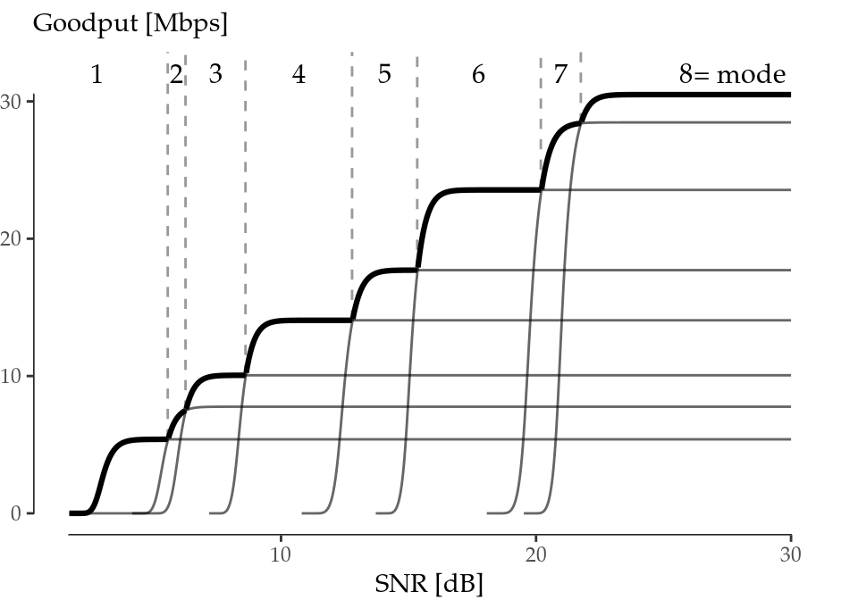
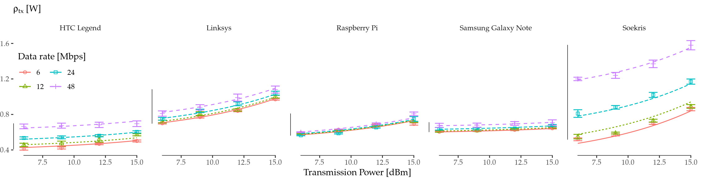
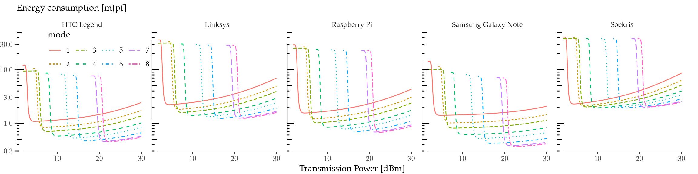
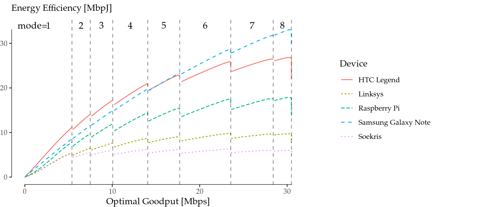
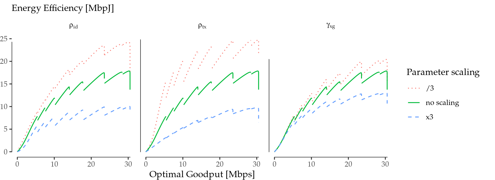

\addtocontents{toc}{\partseparator}

# (PART) Mathematical Modelling {-}

# Rate Adaptation and Power Control in 802.11 {#ch:06}

Rate adaptation is a fundamental technique in 802.11 networks by which wireless transmistters adapt their transmission data rate to the prevailing channel conditions. As we have learnt from previous chapters, the energy consumption of wireless interfaces depends on the chosen modulation and coding scheme, which defines the data rate. On the other hand, *transmission power control*, which has gained increase attention due to network densification, tries to minimise the amount of radiated power (and, indirectly, the energy consumption) given a set of radio conditions. 

These two competing techniques are typically assessed in terms of throughput achieved, while it is assumed that optimality in terms of this performance figure implies optimality in terms of energy efficiency. This chapter tackles the latter question from a formal standpoint. For this purpose, and  we first present a joint goodput (i.e., the throughtput delivered on top of 802.11) and energy consumption model. Building on this model, we numerically study the relationship between energy consumption and throughput performance in 802.11.

## Joint Goodput-Energy Model

With the aim of isolating the variables of interest, namely, modulation and coding scheme (MCS) and transmission power (TXP), in the following we develop a joint goodput-energy model for a single 802.11 spatial stream in the absence of interfering traffic. This model will let us delve into the fundamental relationship between goodput and energy consumption optimality without confounding effects such as collisions or MIMO.

Beyond this primary intent, it is worth noting that these assumptions conform with real-world scenarios in the scope of recent trends in the IEEE 802.11 standard development (e.g., amendments 11ac and 11ad), where device-to-device communications (mainly through beamforming and MU-MIMO) are of paramount importance.

\pagebreak We base our study on the work by @Qiao2002\cite{Qiao2002}, which develops a robust goodput model that meets the established requirements. This model analyses the IEEE 802.11a Distributed Coordination Function (DCF) over the assumption of additive white Gaussian noise (AWGN) channel without interfering traffic.

Let us briefly introduce the reader to the main concepts, essential to our analysis, of the goodput model by @Qiao2002. Given a packet of length $l$ ready to be sent, a frame retry limit $n_\mathrm{max}$ and a set of channel conditions $\hat{s}=\{s_1, \ldots, s_{n_\mathrm{max}}\}$ and modulations $\hat{m}=\{m_1, \ldots, m_{n_\mathrm{max}}\}$ used during the potential transmission attempts, the *expected effective goodput* $\mathcal{G}$ is modelled as the ratio between the expected delivered data payload and the expected transmission time as follows:

\begin{equation}
 \mathcal{G}(l, \hat{s}, \hat{m}) = \frac{{\mathbb E}\left[ \mathrm{data} \right]}{{\mathbb E}\left[ \mathcal{D}_\mathrm{data} \right]} = \frac{\Pr[\mathrm{succ} \mid l, \hat{s}, \hat{m}]\cdot l}{{\mathbb E}\left[ \mathcal{D}_\mathrm{data} \right]}
 (\#eq:goodput)
\end{equation}

where $\Pr[\mathrm{succ} \mid l, \hat{s}, \hat{m}]$ is the probability of successful transmission conditioned to $l, \hat{s}, \hat{m}$, given in @Qiao2002 [Equation (5)]. This model is valid as long as the coherence time is equal or greater than a single retry, i.e., the channel condition $s_i$ is constant.

The expected transmission time is defined as follows:

\begin{equation}
\begin{split}
 {\mathbb E}\left[ \mathcal{D}_\mathrm{data} \right] = \left(1 - \Pr[\mathrm{succ} \mid l, \hat{s}, \hat{m}]\right) \cdot \mathcal{D}_{\mathrm{fail} \mid l, \hat{s}, \hat{m}} \\
 + \Pr[\mathrm{succ} \mid l, \hat{s}, \hat{m}] \cdot \mathcal{D}_{\mathrm{succ} \mid l, \hat{s}, \hat{m}}
\end{split}
(\#eq:Ddata)
\end{equation}

where

\begin{equation}
\begin{split}
 \mathcal{D}_{\mathrm{succ} \mid l, \hat{s}, \hat{m}} = &\sum_{n=1}^{n_\mathrm{max}} \Pr[n \mathrm{~succ} \mid l, \hat{s}, \hat{m}] \cdot \biggl\lbrace \overline{T}_\mathrm{bkoff}(1) \biggr. \\
 &+ \sum_{i=2}^{n_\mathrm{max}} \left[\overline{T}_\mathrm{bkoff}(i)\right.+ \left.T_\mathrm{data}(l, m_i) + \overline{\mathcal{D}}_\mathrm{wait}(i)\right] \\
 &+ T_\mathrm{data}(l, m_1) + T_\mathrm{SIFS} + \biggl.T_\mathrm{ACK}(m'_n) + T_\mathrm{DIFS} \biggr\rbrace
\end{split}
(\#eq:Dsucc)
\end{equation}

is the average duration of a successful transmission and

\begin{equation}
 \mathcal{D}_{\mathrm{fail} \mid l, \hat{s}, \hat{m}} = \sum_{i=1}^{n_\mathrm{max}} \left[\overline{T}_\mathrm{bkoff}(i) + T_\mathrm{data}(l, m_i) + \overline{\mathcal{D}}_\mathrm{wait}(i+1)\right] 
(\#eq:Dfail)
\end{equation}

is the average time wasted during the $n_\mathrm{max}$ attempts when the transmission fails.

$\Pr[n \mathrm{~succ} \mid l, \hat{s}, \hat{m}]$ is the probability of successful transmission at the $n$-th attempt conditioned to $l, \hat{s}, \hat{m}$, and $\overline{\mathcal{D}}_\mathrm{wait}(i)$ is the average waiting time before the $i$-th attempt. Their expressions are given in @Qiao2002 [Equations (7)--(8)]. The transmission time ($T_\mathrm{data}$), ACK time ($T_\mathrm{ACK}$) and average backoff time ($\overline{T}_\mathrm{bkoff}$) are given in @Qiao2002 [Equations (1)--(3)]. Finally, $T_\mathrm{SIFS}$ and $T_\mathrm{DIFS}$ are 802.11a parameters, and they can be found also in @Qiao2002 [Table 2].

The selected energy model is again the work by @Serrano2014\cite{Serrano2014}, which stands as the most accurate energy model for 802.11 devices published so far. While classical models focused on the wireless interface solely, this one demonstrates empirically that the energy consumed by the device itself cannot be neglected as a device-dependent constant contribution. Conversely, devices incur an energy cost derived from the frame processing, which may impact the relationship that we want to evaluate in this paper.

Putting together both models, we are now in a position to build a joint goodput-energy model for 802.11a DCF. Let us consider the average durations \@ref(eq:Dsucc) and \@ref(eq:Dfail). Based on their expressions, we multiply the idle time ($\overline{\mathcal{D}}_\mathrm{wait}$, $\overline{T}_\mathrm{bkoff}$, $T_\mathrm{SIFS}$, $T_\mathrm{DIFS}$) by $\rho_\mathrm{id}$, the transmission time ($T_\mathrm{data}$) by $\rho_\mathrm{tx}$, and the reception time ($T_\mathrm{ACK}$) by $\rho_\mathrm{rx}$. The resulting expressions are the average energy consumed in a successful transmission $\mathcal{E}_{\mathrm{succ} \mid l, \hat{s}, \hat{m}}$ and the average energy wasted when a transmission fails $\mathcal{E}_{\mathrm{fail} \mid l, \hat{s}, \hat{m}}$:

\begin{equation}
\begin{split}
 \mathcal{E}_{\mathrm{succ} \mid l, \hat{s}, \hat{m}} = &\sum_{n=1}^{n_\mathrm{max}} \Pr[n \mathrm{~succ} \mid l, \hat{s}, \hat{m}] \cdot \biggl\lbrace \rho_\mathrm{id}\overline{T}_\mathrm{bkoff}(1) \biggr. \\
 &+ \sum_{i=2}^{n_\mathrm{max}} \left[\rho_\mathrm{id}\overline{T}_\mathrm{bkoff}(i)\right.+ \left.\rho_\mathrm{tx}T_\mathrm{data}(l, m_i) + \rho_\mathrm{id}\overline{\mathcal{D}}_\mathrm{wait}(i)\right] \\
 &+ \rho_\mathrm{tx}T_\mathrm{data}(l, m_1) + \rho_\mathrm{id}T_\mathrm{SIFS} + \biggl.\rho_\mathrm{rx}T_\mathrm{ACK}(m'_n) + \rho_\mathrm{id}T_\mathrm{DIFS} \biggr\rbrace
\end{split}
(\#eq:Esucc)
\end{equation}

\begin{equation}
 \mathcal{E}_{\mathrm{fail} \mid l, \hat{s}, \hat{m}} = \sum_{i=1}^{n_\mathrm{max}} \left[\rho_\mathrm{id}\overline{T}_\mathrm{bkoff}(i) + \rho_\mathrm{tx}T_\mathrm{data}(l, m_i) + \rho_\mathrm{id}\overline{\mathcal{D}}_\mathrm{wait}(i+1)\right]
(\#eq:Efail)
\end{equation}

\SPACE
Then, by analogy with \@ref(eq:Ddata), the *expected energy consumed per frame transmitted*, ${\mathbb E}\left[ \mathcal{E}_\mathrm{data} \right]$, can be written as follows:

\begin{equation}
\begin{split}
 {\mathbb E}\left[ \mathcal{E}_\mathrm{data} \right] = \gamma_\mathrm{xg} + \left(1 - \Pr[\mathrm{succ} \mid l, \hat{s}, \hat{m}]\right) \cdot \mathcal{E}_{\mathrm{fail} \mid l, \hat{s}, \hat{m}} \\
 + \Pr[\mathrm{succ} \mid l, \hat{s}, \hat{m}] \cdot \mathcal{E}_{\mathrm{succ} \mid l, \hat{s}, \hat{m}}
\end{split}
(\#eq:energyperframe)
\end{equation}

\SPACE
It is noteworthy that the receiving cross-factor does not appear in this expression because ACKs (acknowledgements) are processed in the network card exclusively, and thus its processing toll is negligible.

Finally, we define the *expected effective energy efficiency* $\mu$ as the ratio between the expected delivered data payload and the expected energy consumed per frame, which can be expressed in *bits per Joule* (bpJ):

\begin{equation}
 \mu(l, \hat{s}, \hat{m}) = \frac{{\mathbb E}\left[ \mathrm{data} \right]}{{\mathbb E}\left[ \mathcal{E}_\mathrm{data} \right]}
 (\#eq:efficiency)
\end{equation}

## Numerical Results

Building on the joint model presented in the previous section, here we explore the relationship between optimal goodput and energy efficiency in 802.11a. More specifically, our objective is to understand the behaviour of the energy efficiency of a single spatial stream as the MCS and TXP change following our model to meet the optimal goodput.

### Optimal Goodput

We note that the main goal of RA, generally, is to maximise the effective goodput that a station can achieve by varying the parameters of the interface. In terms of the model discussed in the previous section, a rate adaptation algorithm would aspire to fit the following curve:

\begin{equation}
 \max{\mathcal{G}(l, \hat{s}, \hat{m})} (\#eq:maxgoodput)
\end{equation}

\SPACE
We provide the numerical results for this goodput maximisation problem in Figure \@ref(fig:maxgoodput), which are in good agreement with those obtained in @Qiao2002. For the sake of simplicity but without loss of generality we fix $l=1500$ octets and $n_\mathrm{max}=7$ retries, and assume that the channel conditions and the transmission strategy are constant across retries ($\hat{s}=\{s_1, \ldots, s_1\}$ and $\hat{m}=\{m_1, \ldots, m_1\}$).

Figure \@ref(fig:maxgoodput) illustrates which mode (see Table \@ref(tab:modes)) is optimal in terms of goodput, given an SNR level. We next address the question of whether this optimisation is aligned with energy efficiency maximisation.

(ref:maxgoodput) Optimal goodput (bold envelope) as a function of SNR.

(\#fig:maxgoodput)(ref:maxgoodput)

<table class="table" style="margin-left: auto; margin-right: auto;">
<caption>(\#tab:modes)IEEE 802.11a PHY.</caption>
 <thead>
  <tr>
   <th style="text-align:right;">   </th>
   <th style="text-align:right;"> Mode Index </th>
   <th style="text-align:right;"> MCS [Mbps] </th>
  </tr>
 </thead>
<tbody>
  <tr>
   <td style="text-align:right;">  </td>
   <td style="text-align:right;"> 1 </td>
   <td style="text-align:right;"> 6 </td>
  </tr>
  <tr>
   <td style="text-align:right;">  </td>
   <td style="text-align:right;"> 2 </td>
   <td style="text-align:right;"> 9 </td>
  </tr>
  <tr>
   <td style="text-align:right;">  </td>
   <td style="text-align:right;"> 3 </td>
   <td style="text-align:right;"> 12 </td>
  </tr>
  <tr>
   <td style="text-align:right;">  </td>
   <td style="text-align:right;"> 4 </td>
   <td style="text-align:right;"> 18 </td>
  </tr>
  <tr>
   <td style="text-align:right;">  </td>
   <td style="text-align:right;"> 5 </td>
   <td style="text-align:right;"> 24 </td>
  </tr>
  <tr>
   <td style="text-align:right;">  </td>
   <td style="text-align:right;"> 6 </td>
   <td style="text-align:right;"> 36 </td>
  </tr>
  <tr>
   <td style="text-align:right;">  </td>
   <td style="text-align:right;"> 7 </td>
   <td style="text-align:right;"> 48 </td>
  </tr>
  <tr>
   <td style="text-align:right;">  </td>
   <td style="text-align:right;"> 8 </td>
   <td style="text-align:right;"> 54 </td>
  </tr>
</tbody>
</table>

### Extension of the Energy Parametrisation

The next step is to delve into the energy consumption of wireless devices. @Serrano2014 provides real measurements for five devices: three AP-like platforms (Linksys WRT54G, Raspberry Pi and Soekris net4826-48) and two hand-held devices (HTC Legend and Samsung Galaxy Note 10.1). Two of the four parameters needed are constant ($\rho_\mathrm{id}, \gamma_\mathrm{xg}$), and the other two ($\rho_\mathrm{tx}, \rho_\mathrm{rx}$) depend on the MCS and the TXP used. However, the characterisation done by @Serrano2014 is performed for a subset of the MCS and TXP available, so we next detail how we extend the model to account for a larger set of operation parameters.

A detailed analysis of the numerical figures presented in @Serrano2014 suggests that $\rho_\mathrm{rx}$ depends linearly on the MCS, and that $\rho_\mathrm{tx}$ depends linearly on the MCS and the TXP (in mW). Based on these observations, we define the following linear models:

\begin{equation}
\begin{split}
 \rho_\mathrm{tx} &= \alpha_0 + \alpha_1\cdot\mathrm{MCS} + \alpha_2\cdot\mathrm{TXP} \\
 \rho_\mathrm{rx} &= \beta_0 + \beta_1\cdot\mathrm{MCS}
\end{split}
(\#eq:linearmodels)
\end{equation}

\SPACE
The models are fed with the data reported in @Serrano2014, and the resulting fitting is illustrated in Figure \@ref(fig:rho-tx-rx), while Table \@ref(tab:regressions-tx) collects the model estimates for each device (with errors between parentheses), as well as the adjusted r-squared. Since these linear models show a very good fit, they support the generation of synthetic data for the different MCS and TXP required.

(ref:rho-tx-rx) Linear regressions. $\rho_\mathrm{tx}$ fit as a function of MCS and TXP (top) and $\rho_\mathrm{rx}$ fit as a function of MCS (bottom).

(\#fig:rho-tx-rx)(ref:rho-tx-rx)

<table class="table" style="margin-left: auto; margin-right: auto;">
<caption>(\#tab:regressions-tx)Linear regressions.</caption>
 <thead>
<tr>
<th style="border-bottom:hidden" colspan="1"></th>
<th style="border-bottom:hidden; padding-bottom:0; padding-left:3px;padding-right:3px;text-align: center; " colspan="4">
$\rho_\mathrm{tx}$ model estimates
</th>
<th style="border-bottom:hidden; padding-bottom:0; padding-left:3px;padding-right:3px;text-align: center; " colspan="3">
$\rho_\mathrm{rx}$ model estimates
</th>
</tr>
  <tr>
   <th style="text-align:right;"> Device </th>
   <th style="text-align:left;"> $\alpha_0$ [W] </th>
   <th style="text-align:left;"> $\alpha_1$ [W/Mbps] </th>
   <th style="text-align:left;"> $\alpha_2$ [W/mW] </th>
   <th style="text-align:center;"> adj. $r^2$ </th>
   <th style="text-align:left;"> $\beta_0$ [W] </th>
   <th style="text-align:left;"> $\beta_1$ [W/Mbps] </th>
   <th style="text-align:center;"> adj. $r^2$ </th>
  </tr>
 </thead>
<tbody>
  <tr>
   <td style="text-align:right;"> HTC Legend </td>
   <td style="text-align:left;"> 0.35(1) </td>
   <td style="text-align:left;"> 0.0052(3) </td>
   <td style="text-align:left;"> 0.021(3) </td>
   <td style="text-align:center;"> 0.966 </td>
   <td style="text-align:left;"> 0.013(3) </td>
   <td style="text-align:left;"> 0.0064(1) </td>
   <td style="text-align:center;"> 0.995 </td>
  </tr>
  <tr>
   <td style="text-align:right;"> Linksys </td>
   <td style="text-align:left;"> 0.54(1) </td>
   <td style="text-align:left;"> 0.0028(2) </td>
   <td style="text-align:left;"> 0.075(3) </td>
   <td style="text-align:center;"> 0.982 </td>
   <td style="text-align:left;"> 0.14(2) </td>
   <td style="text-align:left;"> 0.0130(7) </td>
   <td style="text-align:center;"> 0.957 </td>
  </tr>
  <tr>
   <td style="text-align:right;"> Raspberry Pi </td>
   <td style="text-align:left;"> 0.48(2) </td>
   <td style="text-align:left;"> 0.0008(4) </td>
   <td style="text-align:left;"> 0.044(5) </td>
   <td style="text-align:center;"> 0.866 </td>
   <td style="text-align:left;"> -0.006(1) </td>
   <td style="text-align:left;"> 0.00146(5) </td>
   <td style="text-align:center;"> 0.982 </td>
  </tr>
  <tr>
   <td style="text-align:right;"> Samsung Galaxy Note </td>
   <td style="text-align:left;"> 0.572(4) </td>
   <td style="text-align:left;"> 0.00166(8) </td>
   <td style="text-align:left;"> 0.0105(9) </td>
   <td style="text-align:center;"> 0.975 </td>
   <td style="text-align:left;"> 0.041(1) </td>
   <td style="text-align:left;"> 0.00173(4) </td>
   <td style="text-align:center;"> 0.993 </td>
  </tr>
  <tr>
   <td style="text-align:right;"> Soekris </td>
   <td style="text-align:left;"> 0.17(3) </td>
   <td style="text-align:left;"> 0.0170(6) </td>
   <td style="text-align:left;"> 0.101(7) </td>
   <td style="text-align:center;"> 0.986 </td>
   <td style="text-align:left;"> 0.010(8) </td>
   <td style="text-align:left;"> 0.0237(3) </td>
   <td style="text-align:center;"> 0.998 </td>
  </tr>
</tbody>
</table>

### Energy Consumption

To compute the energy consumption using the above parametrisation, first we have to define the assumptions for the considered scenario. We assume for simplicity a device-to-device communication, with fixed and reciprocal channel conditions during a sufficient period of time (i.e., low or no mobility). As we have discussed before, our primary goal is to isolate MCS and TXP as variables of interest, but we must not forget that these are also reasonable assumptions in scenarios targeted by recent 802.11 standard developments (11ac, 11ad).

For instance, given channel state information from a receiver, the transmitter may decide to increase the TXP in order to increase the receiver's SNR (and thus the expected goodput), or to decrease it if the channel quality is high enough. Although the actual relationship between TXP and SNR depends on the specific channel model (e.g., distance, obstacles, noise), without loss of generality, we choose a noise floor of $N=-85$ dBm in an office scenario with a link distance of $d=18$ m in order to explore numerically the whole range of SNR while using reasonable values of TXP. The ITU model for indoor attenuation [@iturp1238-2015] gives a path loss of $L\approx 85$ dBm. Then, we can use \@ref(eq:energyperframe) to obtain the expected energy consumed per frame and MCS mode, with TXP being directly related to the SNR level.

(ref:consumption) Expected energy consumption per frame in *millijoules per frame* (mJpf) under fixed channel conditions.

(\#fig:consumption)(ref:consumption)

The results are reported in Figure \@ref(fig:consumption). As the figure illustrates, consumption first falls abruptly as the TXP increases for all modes, which is caused when the SNR reaches a sharp threshold level such that the number of retransmissions changes from 6 to 0 (i.e., no frame is discarded). From this threshold on, the consumption increases with TXP because, although the number of retransmissions is 0, the wireless interface consumes more power. We note that the actual value of the TXP when the consumption drops depends on the specifics of the scenario considered, but the qualitative conclusions hold for a variety of scenarios.

### Energy Efficiency vs. Optimal Goodput

We can finally merge previous numerical analyses and confront energy efficiency, given by \@ref(eq:efficiency), and optimal goodput, given by \@ref(eq:maxgoodput), for all devices and under the aforementioned assumptions. To this aim, we plot in the same figure the energy efficiency for the configuration that maximises goodput given an SNR value vs. the obtained goodput, with the results being depicted in Figure \@ref(fig:efficiency-goodput). We next discuss the main findings from the figure.

(ref:efficiency-goodput) Energy efficiency vs. optimal goodput under fixed channel conditions.

(\#fig:efficiency-goodput)(ref:efficiency-goodput)

First of all, we can see that the energy efficiency grows sub-linearly with the optimal goodput (the optimal goodput for each SNR value) in all cases. We may distinguish three different cases in terms of energy efficiency: high (Samsung Galaxy Note and HTC Legend), medium (Raspberry Pi) and low energy efficiency (Linksys and Soekris). Furthermore, for the case of the Soekris, we note that the "central modes" (namely, 4 and 5) are more efficient in their optimal region than the subsequent ones.

Another finding (more relevant perhaps) is that it becomes evident that increasing the goodput does not always improve the energy efficiency: there are more or less drastic leaps, depending on the device, between mode transitions. From the transmitter point of view, in the described scenario, this can be read as follows: we may increase the TXP to increase the SNR, but if the optimal goodput entails a mode transition, the energy efficiency may be affected.

As a conclusion, we have demonstrated that optimal goodput and energy efficiency do not go hand in hand, even in a single spatial stream, in 802.11^[These findings have been further confirmed with an experimental validation, which is covered in Appendix \@ref(experimental-validation-of-ra-tpc-inefficiencies).]. There is a trade-off in some circumstances that current rate adaptation algorithms cannot take into account, as they are oblivious to the energy consumption characteristic of the device.

## Discussion

### Sensitivity to Energy Parameter Scaling

We next explore how the different energy parameters affect the energy efficiency vs. optimal goodput relationship. For this purpose, we selected the Raspberry Pi curve from Figure \@ref(fig:efficiency-goodput) (results are analogous with the other devices) and we scale up and down, one at a time, the four energy parameters $\rho_\mathrm{id}$, $\rho_\mathrm{tx}$, $\rho_\mathrm{rx}$, and $\gamma_\mathrm{xg}$. The scaling up and down is done by multiplying and dividing by 3, respectively, the numerical value of the considered parameter. One of the first results is that the impact of $\rho_\mathrm{rx}$ is negligible, a result somehow expected as the cost of receiving the ACK is practically zero. From this point on, we do not further consider this parameter.

(ref:param-scaling1) Impact of energy parameter scaling on the energy efficiency. Overall effect.

(\#fig:param-scaling1)(ref:param-scaling1)

We show in Figure \@ref(fig:param-scaling1) the overall effect of this parameter scaling. The solid line represents the base case with no scaling (same curve as in Figure \@ref(fig:efficiency-goodput)), and in dashed and dotted lines the corresponding parameter was multiplied or divided by a factor of 3, respectively. As expected, larger parameters contribute to lower the overall energy efficiency. However, the impact on the energy efficiency drops between mode transitions is far from being obvious, as in some cases transitions are more subtle while in others they become more abrupt.

(ref:param-scaling2) Impact of energy parameter scaling on the energy efficiency. Impact on mode transitions.

(\#fig:param-scaling2)(ref:param-scaling2)

To delve into these transitions, we illustrate in Figure \@ref(fig:param-scaling2) the "drop" in energy efficiency when changing between modes. As it can be seen, the cross-factor $\gamma_\mathrm{xg}$ is the less sensitive parameter of the three, because its overall effect is limited and, more importantly, it scales all the leaps between mode transitions homogeneously. This means that a higher or lower cross-factor, which resides almost entirely in the device and not in the wireless card, does not alter the energy efficiency vs. optimal goodput relationship^[Note that this parameter results in a constant term in Equation \@ref(eq:energyperframe).]. Thus, the cross-factor is not relevant from the RA-TPC point of view, and energy-aware RA-TPC algorithms can be implemented by leveraging energy parameters local to the wireless card.

On the other hand, $\rho_\mathrm{id}$ and $\rho_\mathrm{tx}$ have a larger overall effect, plus an inhomogeneous and, in general, opposite impact on mode transitions. While a larger $\rho_\mathrm{id}$ contributes to larger leaps, for the case of $\rho_\mathrm{tx}$, the larger energy efficiency drops occur with smaller values of that parameter. Still, the reason behind this behaviour is the same for both cases: the wireless card spends more time in idle (and less time transmitting) when a transition to the next mode occurs, which has a higher data rate.

This effect is also evident if we compare the Samsung Galaxy Note and the HTC Legend curves in Figure \@ref(fig:efficiency-goodput). Both devices have $\rho_\mathrm{id}$ and $\rho_\mathrm{tx}$ in the same order of magnitude, but the HTC Legend has a larger $\rho_\mathrm{id}$ and a smaller $\rho_\mathrm{tx}$. The combined outcome is a more dramatic sub-linear behaviour and an increased energy efficiency drop between mode transitions.

### Heuristics for RA-TPC Algorithms

We have seen that the energy efficiency vs. optimal goodput relationship shows a signature "sawtooth" pattern when RA and TPC are considered for a single 802.11 spatial stream. This sawtooth shape presents a growing trend in the central part of each mode, but there are energy efficiency drops between mode transitions, which conceal a trade-off.

Parameter scaling has diverse effects on the final consumption signature, but overall, the qualitative behaviour (i.e., the shape) remains the same. The cross-factor produces an homogeneous scaling of the sawtooth. Thus, a first conclusion is that the trade-off depends on the energy parameters local to the wireless card, which means that a properly designed energy-aware RA-TPC algorithm can be device-agnostic.

Moreover, an energy-aware RA-TCP algorithm may also be card-agnostic. This is because the inefficiencies are always constrained at mode transitions, which are exactly the points at which RA-TPC algorithms take decisions. Therefore, there is no need of knowing the exact energy parametrisation, nor the instantaneous power consumption of the wireless card, in order to take energy-efficient decisions.

An RA-TPC algorithm moves along the sawtooth shapes of Figure \@ref(fig:efficiency-goodput) in two directions, namely, "up" (towards higher throughput) and "down" (towards lower throughput). In this way, an algorithm requires different policies to make a decision:

(i) In the *upwards* direction, in which mode transitions take place by increasing MCS and TXP (to achieve more goodput), a sensitive policy would be to remain in the left side of the leaps, to prevent falling into the efficiency gaps, until the link is good enough to move to a higher MCS with at least the same efficiency. An heuristic for the *upwards* policy may be the following: whenever an algorithm chooses a higher MCS, it may hold the decision for some time and, if it persists, then trigger the MCS change^[However, if this delay is too long, the algorithm will incur in inefficiencies, too.].
(ii) In the *downwards* direction, in which mode transitions take place by decreasing MCS and TXP, a sensitive policy would be to try to reach the left side of the leaps as soon as possible. However, it should be noted that this *downwards* policy is much more challenging, as it implies predicting quality drops to trigger early MCS/TXP changes.

In summary, our results suggest that one of the key points of an energy-aware RA-TPC algorithm is the management of mode transitions. A good algorithm should be *conservative* at mode transitions, in the sense that it should prefer a lower MCS and TXP until a higher MCS can be guaranteed. 

## Summary

We have revisited 802.11 rate adaptation and transmission power control by taking energy consumption into account. While some previous studies pointed out that MIMO rate adaptation is not energy efficient, we have demonstrated through numerical analysis that, even for single spatial streams without interfering traffic, energy consumption and throughput performance are different optimisation objectives.

Our findings [@contrib-06] show that this trade-off emerges at certain "mode transitions" when maximising the goodput, suggesting that small goodput degradations may lead to energy efficiency gains. For instance, a station at the edge of a mode transition may decide to reduce the transmission power a little in order to downgrade the modulation coding scheme. Or an opportunity to achieve a better goodput by increasing the transmission power and modulation coding scheme could be delayed if the expected gain is small.
