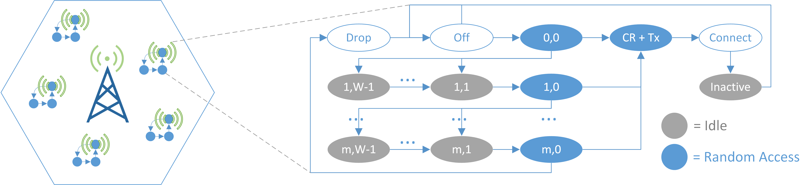

# A Novel Discrete-Event Simulation Framework {#ch:08}

<span class="newthought">Simulation frameworks</span> are important tools for the analysis and design of communication networks and protocols, but they can result extremely costly and/or complex (for the case of very specialised tools), or too naive and lacking proper features and support (for the case of ad-hoc tools). Our own research experience in the previous chapter has pointed us towards the need for new tools sitting between these two paradigms, supporting the efficient simulation of relatively complex scenarios at a low implementation cost. 

In this chapter, we introduce a recent event-driven simulation package, `simmer`, and show its applicability in fast prototyping. `simmer` sits between the above two complexity extremes, and combines a number of features that supports, among others, versatility and repeatability. More specifically, some of the key advantages of `simmer` are as follows:

- It is based on the very popular R programming language [@R-base], which benefits from a large community of users and contributors, but also natively supports the analysis of results via the many R statistical and visualization packages.
- The code has been peer-reviewed, and it is an official package [@R-simmer], with numerous examples readily available, potentially supported by a notable user population.
- In addition to its ease of use and versatility, its code is partially optimised for speed, and therefore it can simulate relatively complex scenarios under reasonable times.

In the following, we first describe the simulation core design and its architecture. Then we provide a quick overview of `simmer` and its key features. Finally, we showcase the versatility of `simmer` to easily model a Massive Internet-of-Things (IoT) scenario where thousands of metering devices share the same channel. Here, we analyse the impact of access parameters on performance, with a particular interest in the energy required to deliver the information, which will ultimately impact the lifetime of devices running on batteries. 

## The Simulation Core Design

The core of any modern discrete-event simulator comprises two main components: an event list, ordered by time of occurrence, and an event loop that extracts and executes events. In contrast to other interpreted languages such as Python, which is compiled by default to an intermediate byte-code, R code is purely parsed and evaluated at runtime^[Some effort has been made in this line with the `compiler` package, introduced in R version 2.13.0 [@R:compiler], furthermore, a JIT-compiler was included in R version 3.4.0.]. This fact makes it a particularly slow language for Discrete-Event Simulation (DES), which consists of executing complex routines (pieces of code associated to the events) inside a loop while constantly allocating and deallocating objects (in the event queue).

In fact, first attempts were made in pure R by these authors, and a  minimal process-based implementation with `R6` classes [@CRAN:R6] proved to be  unfeasible in terms of performance compared to similar approaches in pure Python. For this reason, it was decided to provide a robust and fast simulation core written in C++. The R API interfaces with this C++ core by leveraging the `Rcpp` package [@Eddelbuettel:2011:Rcpp;@Eddelbuettel:2013:Rcpp], which has become one of the most popular ways of extending R packages  with C or C++ code.

The following sections are devoted to describe the simulation core architecture. First, we establish the DES terminology used in the rest of the paper. Then, the architectural choices made are discussed, as well as the event queue and the *simultaneity problem*,  an important topic that every DES framework has to deal with.

### Terminology

This document uses some DES-specific terminology, e.g., *event*, *state*, *entity*, *process* or *attribute*. Such standard terms can be easily found in any textbook about DES (refer to @Banks:2005:Discrete\cite{Banks:2005:Discrete}, for instance). There are, however, some `simmer`-specific terms, and some elements that require further explanation to understand the package architecture.

Resource
  ~ A passive entity, as it is commonly understood in standard DES terminology. However, `simmer` resources are conceived with queuing systems in mind, and therefore they comprise two internal self-managed parts:

    Server
      ~ which, conceptually, represents the resource itself. It has a specified capacity and can be seized and released.

    Queue
      ~ A priority queue of a certain size.

Manager
 ~ An active entity, i.e., a process, that has the ability to adjust properties of a resource (capacity and queue size) at run-time.

Source
  ~ A process responsible for creating new *arrivals* with a given interarrival time pattern and inserting them into the simulation model.

Arrival
  ~ A process capable of interacting with resources or other entities of the simulation model. It may have some attributes and prioritisation values associated and, in general, a limited lifetime. Upon creation, every arrival is attached to a given *trajectory*.

Trajectory
  ~ An interlinkage of *activities* constituting a recipe for arrivals attached to it, i.e., an ordered set of actions that must be executed. The simulation model is ultimately represented by a set of trajectories.

Activity
  ~ The individual unit of action that allows arrivals to interact with resources and other entities, perform custom routines while spending time in the system, move back and forth through the trajectory dynamically, and much more.

### Architecture

Extending an R package (or any other piece of software written in any interpreted language) with compiled code poses an important trade-off between performance and flexibility: placing too much functionality into the compiled part produces gains in performance, but degrades modelling capabilities, and vice versa. The following lines are devoted to discuss how this trade-off is resolved in `simmer`.

Figure \@ref(fig:architecture) sketches a UML (Unified Modelling Language) description of the architecture, which constitutes a process-based design, as in many modern DES frameworks. We draw the attention now to the C++ classes (depicted in white).

(ref:architecture) UML diagram of the simulation core architecture. Blue classes represent how R encapsulates the C++ core. Blue circles represent how C++ interfaces with R.

<div class="figure" style="text-align: center">

<p class="caption">(\#fig:architecture)(ref:architecture)</p>
</div>

The first main component is the `Simulator` class. It comprises the event loop and the event queue, which will be addressed in the next section. The `Simulator` provides methods for scheduling and unscheduling events. Moreover, it is responsible for managing simulation-wide entities (e.g., resources and arrival sources) and facilities (e.g., signaling between processes and batches) through diverse C++ unordered maps:

- Maps of resources and processes (sources, arrivals and managers) by name.
- A map of pending events, which allows to unschedule a given process.
- Maps of signals subscribed by arrivals and handlers defined for different signals.
- Maps for forming batches of arrivals, named and unnamed.

This class also holds global attributes and monitoring information. Thus, monitoring counters, which are derived from the `Monitor` class, are centralised, and they register every change of state produced during the simulation time. There are five types of built-in changes of state that are recorded by calling `Monitor`'s `record_*()` methods:

- An arrival is accepted into a resource (served or enqueued). The resource notifies about the new status of its internal counters.
- An arrival leaves a resource. The resource notifies the new status of its internal counters, and the arrival notifies start, end and activity times in that particular resource.
- A resource is modified during runtime (i.e., a change in the capacity or queue size). The resource notifies the new status of its internal counters.
- An arrival modifies an attribute, one of its own or a global one. The arrival notifies the new value.
- An arrival leaves its trajectory by exhausting the activities associated (considered as *finished*) or because of another reason (*non-finished*, e.g., it is rejected from a resource). The arrival notifies global start, end and activity times.

As mentioned in the previous section, there are two types of entities: passive ones (`Resource`) and active ones (processes `Source`, `Arrival` and `Manager`). Sources create new arrivals, and the latter are the main actors of the simulation model. Managers can be used for dynamically changing the properties of a resource (capacity and queue size). All processes share a `run()` method that is invoked by the event loop each time a new event is extracted from the event list.

There is a fourth kind of process not shown in Figure \@ref(fig:architecture), called `Task`. It is a generic process that executes a given function once, and it is used by arrivals, resources, activities and the simulator itself to trigger dynamic actions or split up events. A `Task` is for instance used under the hood to trigger reneging or to broadcast signals after some delay.

The last main component, completely isolated from the `Simulator`, is the `Activity` class. This abstract class represents a clonable object, chainable in a double-linked list to form trajectories. Most of the activities provided by `simmer` derive from it. `Fork` is another abstract class (not depicted in Figure \@ref(fig:architecture)) which is derived from `Activity`. Any activity supporting the definition of sub-trajectories must derive from this one instead, such as `Seize`, `Branch` or `Clone`. All the activities must implement the virtual methods `print()` and `run()`.

Finally, it is worth mentioning the couple of blue circles depicted in Figure \@ref(fig:architecture). They represent the *points of presence* of R in the C++ core, i.e., where the core interfaces back with R to execute custom user-defined code.

In summary, the C++ core is responsible for all the heavy tasks, i.e., managing the event loop, the event list, generic resources and processes, collecting all the statistics, and so on. And still, it provides enough flexibility to the user for modelling the interarrival times from R and execute any custom user-defined code through the activities.

### The Event Queue

The event queue is the most fundamental part of any DES software. It is responsible for maintaining a list of events to be executed by the event loop in an ordered fashion by time of occurrence. This last requirement establishes the need for a data structure with a low access, search, insertion and deletion complexity. A binary tree is a well-known data structure that satisfies these properties, and it is commonly used for this purpose. Unfortunately, binary trees, or equivalent structures, cannot be efficiently implemented without pointers, and this is the main reason why pure R is very inefficient for DES.

In `simmer`, the event queue is defined as a C++ multiset, a kind of associative container implemented as a balanced tree internally. Apart from the efficiency, it was selected to support event unscheduling through iterators. Each event holds a pointer to a process, which will be retrieved and run in the event loop. Events are inserted in the event queue ordered by 1) time of occurrence and 2) priority. This secondary order criterion is devoted to solve a common issue for DES software called *the simultaneity problem*.

##### The Simultaneity Problem {-}

As noted by @Ronngren:1999:EOP:301429.301456 and @Jha:2000:SEL:361026.361032\cite{Ronngren:1999:EOP:301429.301456, Jha:2000:SEL:361026.361032}, there are many circumstances from which simultaneous events (i.e., events with the same timestamp) may arise. How they are handled by a DES framework has critical implications on reproducibility and simulation correctness.

As an example of the implications, let us consider an arrival seizing a resource at time $t_{i-1}$, which has `capacity=1` and `queue_size=0`. At time $t_{i}$, two simultaneous events happen: 1) the resource is released, and 2) another arrival tries to seize the resource. It is indisputable what should happen in this situation: the new arrival seizes the resource while the other continues its path. But note that if 2) is executed *before* 1), the new arrival is rejected (!). Therefore, it is obvious that release events must always be executed *before* seize events.

If we consider a dynamically managed resource (i.e., its capacity changes over time) and, instead of the event 1) in the previous example, the manager increases the capacity of the resource, we are in the very same situation. Again, it is obvious that resource managers must be executed *before* seize attempts.

A further analysis reveals that, in order to preserve correctness and prevent a simulation crash, it is necessary to break down resource releases in two parts with different priorities: the release in itself and a post-release event that tries to serve another arrival from the queue. Thus, every resource manager must be executed *after* releases and *before* post-releases. This and other issues are solved with a priority system (see Table \@ref(tab:priorities)) embedded in the event list implementation that provides a deterministic and consistent execution of simultaneous events.

<table class="table" style="margin-left: auto; margin-right: auto;">
<caption>(\#tab:priorities)Priority system (in decreasing order) and events associated.</caption>
 <thead>
  <tr>
   <th style="text-align:left;"> Priority </th>
   <th style="text-align:left;"> Event </th>
  </tr>
 </thead>
<tbody>
  <tr>
   <td style="text-align:left;font-family: monospace;"> MAX </td>
   <td style="text-align:left;"> Terminate arrivals </td>
  </tr>
  <tr>
   <td style="text-align:left;font-family: monospace;"> RELEASE </td>
   <td style="text-align:left;"> Resource release </td>
  </tr>
  <tr>
   <td style="text-align:left;font-family: monospace;"> MANAGER </td>
   <td style="text-align:left;"> Manager action (e.g., resource capacity change) </td>
  </tr>
  <tr>
   <td style="text-align:left;font-family: monospace;"> RELEASE\_POST </td>
   <td style="text-align:left;"> Resource post-release (i.e., serve from the queue) </td>
  </tr>
  <tr>
   <td style="text-align:left;font-family: monospace;"> ... </td>
   <td style="text-align:left;"> General activities </td>
  </tr>
  <tr>
   <td style="text-align:left;font-family: monospace;"> MIN </td>
   <td style="text-align:left;"> Other tasks (e.g., new arrivals, timers...) </td>
  </tr>
</tbody>
</table>

## A Brief Introduction to `simmer`

Note that `simmer` does not aim at substituting NS-3 or OMNeT++, which are the *de facto* standards for open-source network simulations. Instead, `simmer` is designed as a general-purpose DES framework with a human-friendly syntax, and a very gentle learning curve. It can be used to complement other field-specific simulators as a rapid prototyping tool that enable insightful analysis of different designs. As we will illustrate in the next section, with `simmer` it is simple to simulate relatively complex scenarios, with the added benefit of the availability of many convenient data analysis and representation packages, thanks to the use of R.

The R application programming interface (API) exposed by `simmer` revolves around the concept of *trajectory*, which defines the "path" in the simulation for entities of the same type. A trajectory is a recipe for the arrivals attached to it, an ordered set of actions (or *verbs*) chained together with the pipe operator [@CRAN:magrittr] (`%>%`, whose behaviour is similar to the command-line pipe). The following example illustrates a basic `simmer` workflow, modeling the classical case of customers being attended by a single clerk with infinite waiting space in a few lines of code: 


```r
library(simmer)

cust <- trajectory("customer") %>%
  seize("clerk", amount=1) %>%
  timeout(function() rexp(1, 2)) %>%
  release("clerk", amount=1)

env <- simmer("bank") %>%
  add_resource("clerk", capacity=1, queue_size=Inf) %>%
  add_generator("cust", cust, function() rexp(1, 1)) %>%
  run(until=1000)

arrivals  <- get_mon_arrivals(env)
resources <- get_mon_resources(env)
```

Given that both the time at the clerk and between customers are exponential random variables, and the infinite queue length, this example corresponds, in Kendall's notation, to an M/M/1 queue. It serves to illustrate the two main elements of `simmer`: the `trajectory` object and the `simmer` environment (or *simulation environment*).

The `customer` trajectory defines the behaviour of a generic customer: seize a clerk, spend some time, and release it. The `env` simulation environment is then defined as one clerk with infinite queue size and a generator of customers, each one following the trajectory defined above. Based on this syntax, the flexibility is provided through a rich set of activities^[See [https://r-simmer.org/reference/](https://r-simmer.org/reference/).] that can be appended to trajectories, which support: changing arrivals' properties (attributes, priority, batches), different interactions with the resources (select, seize, release, change their properties), and the generators (activate, deactivate, change their properties), and even the definition of branches (simple, depending on a condition, or parallel) and loops. Finally, some support to asynchronous programming is also provided (subscription to signals and registration of handlers).

Not only `simmer` provides a powerful yet simple syntax, but it is also *fast*, for example, faster than equivalent frameworks such as SimPy [@SimPy] and SimJulia [@GitHub:SimJulia] for the Python and Julia languages respectively^[See Appendix \@ref(performance-evaluation-of-simmer) for a complete performance evaluation.]. Furthermore, and perhaps more importantly, `simmer` implements automatic monitoring capabilities: every event is accounted for by default, both for arrivals (starting and ending times, activity time, ending condition, resources traversed) and resources (server and queue status), and all this information can be easily retrieved in standard R data frames for further processing of results (last two lines of the *clerk* example).

## Use case: Energy Efficiency for Massive IoT

We consider the case of a massive Internet-of-Things (mIoT) scenario, a use case for Long Term Evolution (LTE) and next-generation 5G networks, as defined by the 3GPP [@miot]. As Figure \@ref(fig:scenario3def) (left) illustrates, we consider a single LTE macrocell in a dense urban area. The buildings in the cell area are populated with $N$ smart meters (for electricity, gas, and water), and each meter operates independently as a Narrowband IoT (NB-IoT) device.

(ref:scenario3def) Description of the simulation scenario.

<div class="figure" style="text-align: center">

<p class="caption">(\#fig:scenario3def)(ref:scenario3def)</p>
</div>

The devices' behaviour is modeled following the diagram depicted in Figure \@ref(fig:scenario3def) (right), which is a simplified version of the Markov chain model developed in @iotModel [Figure 5]\cite{iotModel}. A device may stay in `RRC Idle` ('Off'), and awakes with some periodicity to upload its reading. This communication phase encompasses a contention-based random access (RA) procedure, with a backoff time randomly chosen between $(0,W)$ time slots, and up to $m$ retransmissions. If the connection request fails, the reading is dropped, and the device returns to the 'Off' state. If the connection is successful, we assume that the device implements the Control Plane Cellular IoT (CP) optimization (see @iotModel), so that the data is transmitted over the `RRC Connection` request phase using the Non Access Stratum (NAS) level. Then, the device has to wait ('Inactive') until the connection is released, and eventually returns to the 'Off' state.

The goal of this use case is to study the effect of synchronization across IoT devices (for instance, due to a power outage) in the energy consumption. As in @iotCollision\cite{iotCollision}, we assume that a device provides its readings as often as every hour, and the cases of $N=\{5, 10, 30\} \cdot 10^3$ devices in one cell are considered. In order to study different levels of synchronization, each node implements an additional backoff window prior to the RA procedure. Furthermore, we selected $m=9$ and $W=20$; the rest of the parameters (power consumption, timings, message sizes...) can be found in @iotModel [Table I].

##### Implementation Details {-}

This scenario requires a single `meter` trajectory implementing the logic of each IoT device in an infinite loop, and $N$ workers are attached to it at $t=0$. 


```r
# IoT device logic
meter <- trajectory() %>%
  trap("reading") %>%
  # sleep
  set_attribute("P", 0) %>%
  wait() %>%
  timeout(function() round(runif(1, 0, param[["backoff"]]), 3)) %>%
  # ra start
  simmer::select(preambles, policy="random") %>%
  seize_selected(
    continue=c(TRUE, TRUE),
    # ra & tx
    post.seize=trajectory() %>%
      set_attribute("P", Pra) %>%
      timeout(Tra) %>%
      release_selected() %>%
      set_attribute("P", Ptx) %>%
      timeout(Ttx),
    # ra & backoff & retry
    reject=trajectory() %>%
      set_attribute("P", Pra) %>%
      timeout(Tra) %>%
      set_attribute("P", Pi) %>%
      timeout(function() sample(1:20, 1) * 1e-3) %>%
      rollback(6, times=m)
  ) %>%
  rollback(5, times=Inf)
```

Each device registers itself for a given signal ("reading"), and waits in sleep mode until a new reading is requested, which is triggered by a secondary trajectory (`trigger`). 


```r
# trigger a reading for all the meters every tx_period
trigger <- trajectory() %>%
  timeout(tx_period) %>%
  send("reading") %>%
  rollback(2, times=Inf)
```

As soon as a new reading is signalled, the RA procedure starts by randomly selecting one of the 54 preambles available, which are defined as resources. The process of seizing a preamble encompasses two sub-trajectories:

- If there are no collisions, the preamble is successfully seized, and the `post.seize` sub-trajectory is executed, which transmits a reading.
- If there is collision, rejection occurs, and the `reject` sub-trajectory is executed, which performs the RA backoff (for a random number of slots), and restarts the RA procedure (for a maximum of $m$ retries).

Both sub-trajectories set the appropriate power levels $P$ for the appropriate amount of time. In this case, these power levels throughout the simulation time are retrieved with the `get_mon_attributes()` method. The energy is concisely computed and represented using the packages `dplyr` [@CRAN:dplyr] and `ggplot` [@CRAN:ggplot2].

(ref:iot-energy) Energy consumption per transmission attempt for different traffic models and number of devices.


```
## Warning: Detecting old grouped_df format, replacing `vars` attribute by
## `groups`
```

<div class="figure" style="text-align: center">

<p class="caption">(\#fig:iot-energy)(ref:iot-energy)</p>
</div>

Figure \@ref(fig:iot-energy) shows the results for one simulated day. It depicts the energy consumed per reading considering a uniform backoff window between 0 and 5 (*highly synchronised*), 10, 30, and 60 seconds (*non-synchronised*). As the number of devices and the level of synchronization grow, the random-access opportunities (RAOs) per second grow as well producing more and more collisions. These collisions cause retries, and a noticeable impact in the energy consumption (up to 12% more energy per reading). Therefore, this use case shows the paramount importance of randomizing node activation in mIoT scenarios in order to avoid RAO peaks and a premature battery drain.

<table>
<caption>(\#tab:simulation-overview)Overview of simulation features.</caption>
 <thead>
  <tr>
   <th style="text-align:left;">   </th>
   <th style="text-align:right;"> Features </th>
  </tr>
 </thead>
<tbody>
  <tr>
   <td style="text-align:left;"> Simulation time (s) </td>
   <td style="text-align:right;"> 150 </td>
  </tr>
  <tr>
   <td style="text-align:left;"> No. of parallel scenarios </td>
   <td style="text-align:right;"> 12 </td>
  </tr>
  <tr>
   <td style="text-align:left;"> Max. events, 1 scenario </td>
   <td style="text-align:right;"> 28364172 </td>
  </tr>
  <tr>
   <td style="text-align:left;"> Total no. of events </td>
   <td style="text-align:right;"> 98952165 </td>
  </tr>
  <tr>
   <td style="text-align:left;"> Implementation lines </td>
   <td style="text-align:right;"> 42 </td>
  </tr>
  <tr>
   <td style="text-align:left;"> Analysis + plotting lines </td>
   <td style="text-align:right;"> 14 </td>
  </tr>
</tbody>
</table>

<span class="newthought">The simulation</span> was run with a machine equipped with an Intel(R) Xeon(R) CPU E5-2620 v4 @ 2.10GHz x4 (32 cores), and 64 GB of RAM, Debian GNU/Linux 8, R 3.3.2, and `simmer` 3.6. Table summarises the main simulation statistics for this scenario. These numbers attest that `simmer` can be used to simulate relatively complex scenarios with very few lines of code^[The full code is available online at [https://r-simmer.org/articles/simmer-aa-5g#energy-efficiency-for-massive-iot](https://r-simmer.org/articles/simmer-aa-5g#energy-efficiency-for-massive-iot).].

## Summary

The `simmer` package presented in this chapter [@contrib-08a] brings a generic yet powerful process-oriented Discrete-Event Simulation framework to R. `simmer` combines a robust and fast simulation core written in C++ with a rich and flexible R API. The main modelling component is the *activity*. Activities are chained together with the pipe operator into *trajectories*, which are common paths for processes of the same type. `simmer` provides a broad set of activities, and allows the user to extend their capabilities with custom R functions.

Monitoring is automatically performed by the underlying simulation core, thereby enabling the user to focus on problem modelling. `simmer` enables simple replication and parallelisation with standard R tools. Data can be extracted into R data frames from a single simulation environment or a list of environments, each of which is marked as a different replication for further analysis.

We have demonstrated [@contrib-08b] the usability and suitability of `simmer` for fast prototyping of a 5G-inspired scenario. The code developed highlights some of the characteristics that make `simmer` attractive for researchers and practitioners in communications research.

- A novel and intuitive trajectory-based approach that simplifies the simulation of large networks of queues, including those with feedback.
- Flexible resources, with dynamic capacity and queue size, priority queueing and preemption.
- Flexible generators of arrivals that can draw interarrival times from any theoretical or empirical distribution via a function call.
- Asynchronous programming features and monitoring capabilities, which helps the researcher focus into the model design.

It is likewise remarkable the ease with which multiple scenarios, with different parameters, can be simulated concurrently thanks to base R functions. Thus, exploring a large number of combinations of parameter values is not only straightforward, but also as fast as the slowest thread given enough number of CPU cores available.
