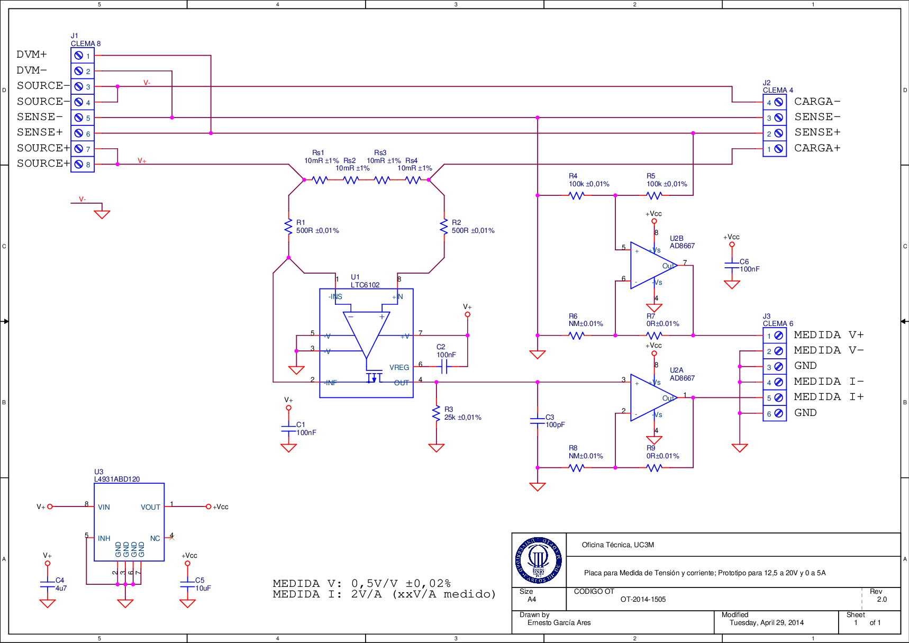
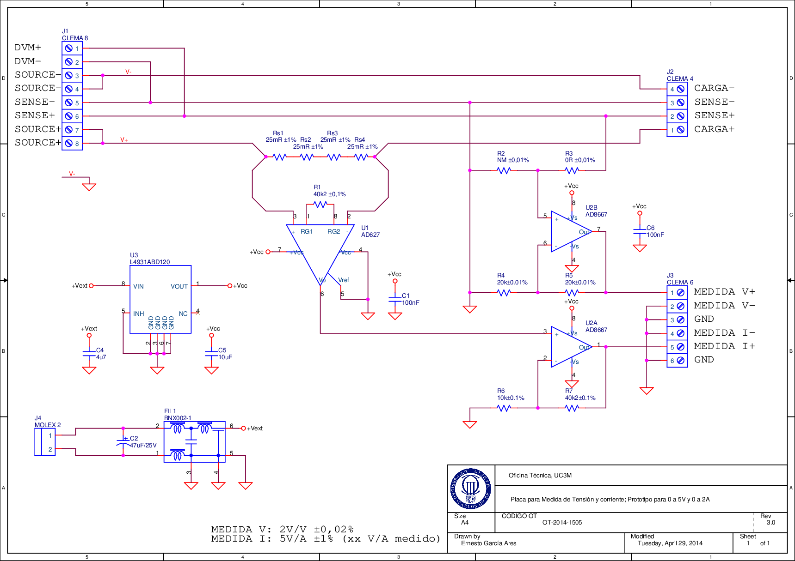

# (APPENDIX) Appendix {-}

# Measurement Circuitry Schematics

`r tufte::newthought("The energy measurement framework")` presented in Chapter \@ref(ch:03) requires custom circuitry to bypass the line that connects the power source to the DUT. The purpose is to extract and adapt the signals of interest (voltage and current) and feed them into the DAQ card within the proper input limits.

The design was conducted in our university's Technical Office in Electronics, which built and calibrated several prototypes based on two schematics for different input ranges:

- A design for 12.5-20 V and 0-5 A, depicted in Figure \@ref(fig:schematicv2).
- A design for 0-5 V and 0-2 A, depicted in Figure \@ref(fig:schematicv3).

`r tufte::newthought("In the schematics")`, `CLEMA 8` is the connector for the power source. It is designed to be powered with a Keithley 2304A DC Power Supply, but it can be attached to other power sources as well. Apart from the `SOURCE+` and `SOURCE-` terminals, there are sensing terminals and measurement terminals (`DVM`) that this Keithley power supply uses to stabilise the output voltage.

The DUT is powered through `CLEMA 4`, and the DAQ card is attached to `CLEMA 6`, where two voltage followers feed the measurement terminals. All cables from these connectors (to the DUT and DAQ respectively) must be shielded and as short as possible in order to minimise losses.

\restorefullwidth

(ref:schematicv2) 12.5-20 V and 0-5 A (100 W max.) prototype.

```{r schematicv2, fig.cap='(ref:schematicv2)', fig.env='sidewaysfigure'}

```

(ref:schematicv3) 0-5 V and 0-2 A (10 W max.) prototype.

```{r schematicv3, fig.cap='(ref:schematicv3)', fig.env='sidewaysfigure'}

```

\restorewidth
