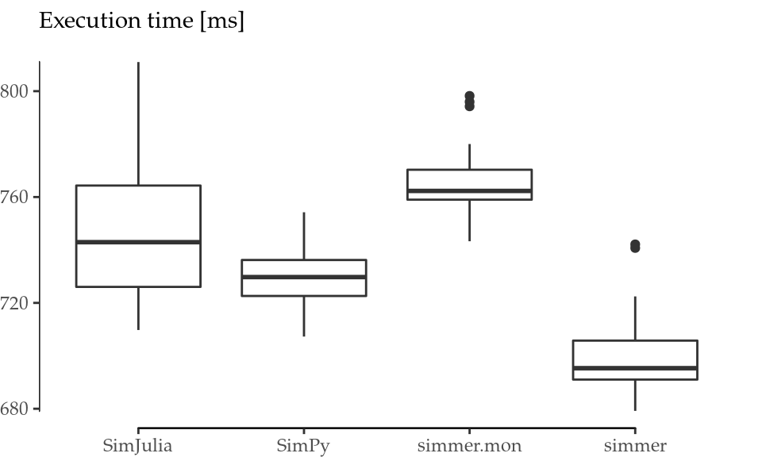
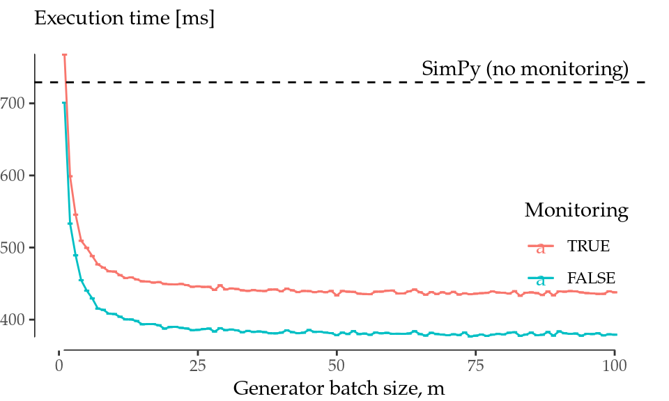

# Performance Evaluation of `simmer`

<span class="newthought">This appendix</span> investigates the performance of `simmer` with the aim of assessing its usability as a general-purpose DES framework. A first section is devoted to measuring the simulation time of a simple model relative to `SimPy` [@SimPy] and `SimJulia` [@GitHub:SimJulia]. The reader may find interesting to compare the expressiveness of each framework. Last but not least, the final section explores the cost of calling R from C++, revealing the existent trade-off, inherent to the design of this package, between performance and model complexity.

All the subsequent tests were performed under Fedora Linux 25 running on an Intel Core2 Quad CPU Q8400, with R 3.3.3, Python 2.7.13, `SimPy` 3.0.9, Julia 0.5.1 and `SimJulia` 0.3.14 from the default repositories. Absolute execution times presented here are specific to this platform and configuration, and thus they should not be taken as representative for any other system. Instead, the relative performance should be approximately constant across different systems.

## Comparison with Similar Frameworks

A significant effort has been put into the design of `simmer` in order to make it performant enough to run general and relatively large simulation models in a reasonable amount of time. In this regard, a relevant comparison can be made against other general-purpose DES frameworks such as `SimPy` and `SimJulia`. To this effect, we simulate a simple M/M/1 queueing system as follows:


```r
library("simmer")

test_mm1_simmer <- function(n, m, mon=FALSE) {
  mm1 <- trajectory() %>%
    seize("server", 1) %>%
    timeout(function() rexp(1, 1.1)) %>%
    release("server", 1)

  env <- simmer() %>%
    add_resource("server", 1, mon=mon) %>%
    add_generator("customer", mm1, function() rexp(m, 1), mon=mon) %>%
    run(until=n)
}
```

With the selected arrival rate, $\lambda=1$, this test simulates an average of `n` arrivals entering a nearly saturated system ($\rho=1/1.1$). Given that `simmer` generators are able to create arrivals in batches (i.e., more than one arrival for each function call) for improved performance, the parameter `m` controls the size of the batch. Finally, the `mon` flag enables or disables monitoring.

Let us build now the equivalent model using `SimPy`, with base Python for random number generation. We prepare the Python benchmark from R using the `rPython` package [@CRAN:rPython] as follows:


```r
rPython::python.exec("
import simpy, random, time

def test_mm1(n):
  def exp_source(env, lambd, server, mu):
      while True:
          dt = random.expovariate(lambd)
          yield env.timeout(dt)
          env.process(customer(env, server, mu))

  def customer(env, server, mu):
      with server.request() as req:
          yield req
          dt = random.expovariate(mu)
          yield env.timeout(dt)

  env = simpy.Environment()
  server = simpy.Resource(env, capacity=1)
  env.process(exp_source(env, 1, server, 1.1))
  env.run(until=n)

def benchmark(n, times):
  results = []
  for i in range(0, times):
    start = time.time()
    test_mm1(n)
    results.append(time.time() - start)
  return results
")
```

Equivalently, this can be done for `SimJulia` using the `rjulia` package [@GitHub:rJulia]. Once more, `n` controls the average number of arrivals:


```r
rjulia::julia_init()
rjulia::julia_void_eval("
using SimJulia, Distributions

function test_mm1(n::Float64)
  function exp_source(env::Environment, lambd::Float64,
                      server::Resource, mu::Float64)
    while true
      dt = rand(Exponential(1/lambd))
      yield(Timeout(env, dt))
      Process(env, customer, server, mu)
    end
  end

  function customer(env::Environment, server::Resource, mu::Float64)
    yield(Request(server))
    dt = rand(Exponential(1/mu))
    yield(Timeout(env, dt))
    yield(Release(server))
  end

  env = Environment()
  server = Resource(env, 1)
  Process(env, exp_source, 1.0, server, 1.1)
  run(env, n)
end

function benchmark(n::Float64, times::Int)
  results = Float64[]
  test_mm1(n)
  for i = 1:times
    push!(results, @elapsed test_mm1(n))
  end
  return(results)
end
")
```

It can be noted that in both cases there is no monitoring involved, because either `SimPy` nor `SimJulia` provide automatic monitoring as `simmer` does. Furthermore, the resulting code for `simmer` is more concise and expressive than the equivalent ones for `SimPy` and `SimJulia`, which are very similar.

We obtain the reference benchmark with `n=1e4` and 20 replicas for both packages as follows:


```r
n <- 1e4L
times <- 20

ref <- data.frame(
  SimPy = rPython::python.call("benchmark", n, times),
  SimJulia = rjulia::j2r(paste0("benchmark(", n, ".0, ", times, ")"))
)
```

As a matter of fact, we also tested a small DES skeleton in pure R provided in @Matloff:2011:ARP:2090080 [s. 7.8.3]. This code was formalised into an R package called `DES`, available on GitHub^[[https://github.com/matloff/des](https://github.com/matloff/des)] since 2014. The original code implemented the event queue as an ordered vector which was updated by performing a binary search. Thus, the execution time of this version was two orders of magnitude slower than the other frameworks. The most recent version on GitHub (as of 2017) takes another clever approach though: it supposes that the event vector will be short and approximately ordered; therefore, the event vector is not sorted anymore, and the next event is found using a simple linear search. These assumptions hold for many cases, and particularly for this M/M/1 scenario. As a result, the performance of this model is only $\sim2.2$ times slower than `SimPy`. Still, it is clear that pure R cannot compete with other languages in discrete-event simulation, and `DES` is not considered in our comparisons hereafter.

Finally, we set a benchmark for `simmer` using the `microbenchmark` package [@CRAN:microbenchmark], again with `n=1e4` and 20 replicas for each test. Figure \@ref(fig:performance-mm1) (left) shows the output of this benchmark. `simmer` is tested both in monitored and in non-monitored mode. The results show that the performance of `simmer` is equivalent to `SimPy` and `SimJulia`. The non-monitored `simmer` shows a slightly better performance than these frameworks, while the monitored `simmer` shows a slightly worse performance.

(ref:performance-mm1) Performance comparison. Boxplots for 20 runs of the M/M/1 test with `n=1e4` (left). Performance evolution with the batch size $m$ (right).

<div class="figure" style="text-align: center">

<p class="caption">(\#fig:performance-mm1)(ref:performance-mm1)</p>
</div>

At this point, it is worth highlighting `simmer`'s ability to generate arrivals in batches (hence parameter $m$). To better understand the impact of batched arrival generation, the benchmark was repeated over a range of $m$ values $(1, \ldots, 100)$. The results of the batched arrival generation runs are shown in Figure \@ref(fig:performance-mm1) (right). This plot depicts the average execution time of the `simmer` model with (red) and without (blue) monitoring as a function of the generator batch size $m$. The black dashed line sets the average execution time of the `SimPy` model to serve as a reference.

The performance with `m=1` corresponds to what has been shown in Figure \@ref(fig:performance-mm1) (left). But as $m$ increases, `simmer` performance quickly improves and becomes $\sim1.6$ to $1.9$ times faster than `SimPy`. Surprisingly, there is no additional gain with batches greater than 40-50 arrivals at a time, but there is no penalty either with bigger batches. Therefore, it is always recommended to generate arrivals in big batches whenever possible.

## The Cost of Calling R from C++

The C++ simulation core provided by `simmer` is quite fast, as we have demonstrated, but performance is adversely affected by numerous calls to R. The practice of calling R from C++ is generally strongly discouraged due to the overhead involved. However, in the case of `simmer`, it not only makes sense, but is even fundamental in order to provide the user with enough flexibility to build all kinds of simulation models. Nevertheless, this cost must be known, and taken into account whenever a higher performance is needed.

To explore the cost of calling R from C++, let us define the following test:


```r
library("simmer")

test_simmer <- function(n, delay) {
  test <- trajectory() %>%
    timeout(delay)

  env <- simmer() %>%
    add_generator("test", test, at(1:n)) %>%
    run(Inf)

  arrivals <- get_mon_arrivals(env)
}
```

\pagebreak This toy example performs a very simple simulation in which `n` arrivals are attached (in one shot, thanks to the convenience function `at()`) to a `test` trajectory at $t=1, 2, ..., n$. The trajectory consists of a single activity: a timeout with some configurable `delay` that may be a fixed value or a function call. Finally, after the simulation, the monitored data is extracted from the simulation core to R. Effectively, this is equivalent to generating a data frame of `n` rows (see the example output in Table \@ref(tab:test-simmer-output-table)).

(ref:test-simmer-output-table) Output from the `test_simmer()` function.

<table class="table" style="margin-left: auto; margin-right: auto;">
<caption>(\#tab:test-simmer-output-table)(ref:test-simmer-output-table)</caption>
 <thead>
  <tr>
   <th style="text-align:right;"> Name </th>
   <th style="text-align:right;"> Start time </th>
   <th style="text-align:right;"> End time </th>
   <th style="text-align:right;"> Activity time </th>
   <th style="text-align:right;"> Finished </th>
   <th style="text-align:right;"> Replication </th>
  </tr>
 </thead>
<tbody>
  <tr>
   <td style="text-align:right;"> test0 </td>
   <td style="text-align:right;"> 1 </td>
   <td style="text-align:right;"> 2 </td>
   <td style="text-align:right;"> 1 </td>
   <td style="text-align:right;"> TRUE </td>
   <td style="text-align:right;"> 1 </td>
  </tr>
  <tr>
   <td style="text-align:right;"> test1 </td>
   <td style="text-align:right;"> 2 </td>
   <td style="text-align:right;"> 3 </td>
   <td style="text-align:right;"> 1 </td>
   <td style="text-align:right;"> TRUE </td>
   <td style="text-align:right;"> 1 </td>
  </tr>
  <tr>
   <td style="text-align:right;"> test2 </td>
   <td style="text-align:right;"> 3 </td>
   <td style="text-align:right;"> 4 </td>
   <td style="text-align:right;"> 1 </td>
   <td style="text-align:right;"> TRUE </td>
   <td style="text-align:right;"> 1 </td>
  </tr>
</tbody>
</table>

As a matter of comparison, the following `test_R_for()` function produces the very same data using base R:


```r
test_R_for <- function(n) {
  name <- character(n)
  start_time <- numeric(n)
  end_time <- numeric(n)
  activity_time <- logical(n)
  finished <- numeric(n)

  for (i in 1:n) {
    name[i] <- paste0("test", i-1)
    start_time[i] <- i
    end_time[i] <- i+1
    activity_time[i] <- 1
    finished[i] <- TRUE
  }

  arrivals <- data.frame(
    name=name,
    start_time=start_time,
    end_time=end_time,
    activity_time=activity_time,
    finished=finished,
    replication = 1
  )
}
```

Note that we are using a `for` loop to mimic the behaviour of `simmer`'s internals, of how monitoring is made, but we concede the advantage of pre-allocated vectors to R. A second base R implementation, which builts upon the `lapply()` function, is implemented as the `test_R_lapply()` function:


```r
test_R_lapply <- function(n) {
  as.data.frame(do.call(rbind, lapply(1:n, function(i) {
    list(
      name = paste0("test", i - 1),
      start_time = i,
      end_time = i + 1,
      activity_time = 1,
      finished = TRUE,
      replication = 1
    )
  })))
}
```

The `test_simmer()`, `test_R_for()` and `test_R_lapply()` functions all produce exactly the same data in a similar manner (cfr. Table \@ref(tab:test-simmer-output-table)). Now, we want to compare how a delay consisting of a function call instead of a fixed value impacts the performance of `simmer`, and we use `test_R_for()` and `test_R_lapply()` as yardsticks.

The benchmark was executed with `n=1e5` and 20 replicas for each test. Table \@ref(tab:performance-table) shows a summary of the resulting timings.

<table class="table" style="margin-left: auto; margin-right: auto;">
<caption>(\#tab:performance-table)Execution time (milliseconds).</caption>
 <thead>
  <tr>
   <th style="text-align:right;"> Expr </th>
   <th style="text-align:right;"> Min </th>
   <th style="text-align:right;"> Mean </th>
   <th style="text-align:right;"> Median </th>
   <th style="text-align:right;"> Max </th>
  </tr>
 </thead>
<tbody>
  <tr>
   <td style="text-align:right;font-family: monospace;"> test\_simmer(n, 1) </td>
   <td style="text-align:right;"> 429.8663 </td>
   <td style="text-align:right;"> 492.365 </td>
   <td style="text-align:right;"> 480.5408 </td>
   <td style="text-align:right;"> 599.3547 </td>
  </tr>
  <tr>
   <td style="text-align:right;font-family: monospace;"> test\_simmer(n, function() 1) </td>
   <td style="text-align:right;"> 3067.9957 </td>
   <td style="text-align:right;"> 3176.963 </td>
   <td style="text-align:right;"> 3165.6859 </td>
   <td style="text-align:right;"> 3434.7979 </td>
  </tr>
  <tr>
   <td style="text-align:right;font-family: monospace;"> test\_R\_for(n) </td>
   <td style="text-align:right;"> 2053.0840 </td>
   <td style="text-align:right;"> 2176.164 </td>
   <td style="text-align:right;"> 2102.5848 </td>
   <td style="text-align:right;"> 2438.6836 </td>
  </tr>
  <tr>
   <td style="text-align:right;font-family: monospace;"> test\_R\_lapply(n) </td>
   <td style="text-align:right;"> 1525.6682 </td>
   <td style="text-align:right;"> 1754.028 </td>
   <td style="text-align:right;"> 1757.7566 </td>
   <td style="text-align:right;"> 2002.6634 </td>
  </tr>
</tbody>
</table>

As we can see, `simmer` is $\sim4.4$ times faster than `for`-based base R and $\sim3.6$ times faster than `lapply`-based base R on average when we set a fixed delay. On the ther hand, if we replace it for a function call, the execution becomes $\sim6.5$ times slower, or $\sim1.5$ times slower than `for`-based base R. It is indeed a quite good result if we take into account the fact that base R pre-allocates memory, and that `simmer` is doing a lot more internally. But still, these results highlight the overheads involved and encourage the use of fixed values instead of function calls whenever possible.
