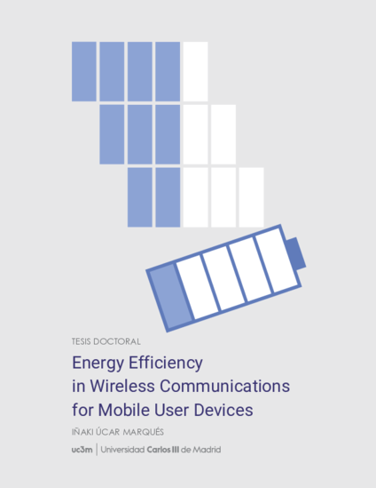

--- 
title: "Energy Efficiency in Wireless Communications for Mobile User Devices"
author: "Iñaki Úcar"
date: "2018-06-07"
site: bookdown::bookdown_site
cover-image: img/cover-front.png
documentclass: book
classoption: twoside,nohyper
bibliography: [thesis.bib, packages.bib]
biblio-style: abbrvnat
link-citations: yes
description: |
  Tesis doctoral. Universidad Carlos III de Madrid. 
  Departamento de Ingeniería Telemática.
abstract: |
  
  
  Mobile user devices' market has experienced an 
  exponential growth worldwide over the last decade, and wireless communications
  are the main driver for the next generation of 5G networks. The ubiquity of
  battery-powered connected devices makes energy efficiency a major research
  issue.
  
  While most studies assumed that network interfaces dominate the energy
  consumption of wireless communications, a recent work unveils that the frame
  processing carried out by the device could drain as much energy as the
  interface itself for many devices. This discovery poses doubts on prior energy
  models for wireless communications and forces us to reconsider existing
  energy-saving schemes.
  
  
  
  From this standpoint, this thesis is devoted to the
  study of the energy efficiency of mobile user devices at multiple layers. To
  that end, we assemble a comprehensive energy measurement framework, and a
  robust methodology, to be able to characterise a wide range of mobile devices,
  as well as individual parts of such devices.
  
  Building on this, we first delve into the energy consumption of frame
  processing within the devices' protocol stack. Our results identify the CPU as
  the leading cause of this energy consumption. Moreover, we discover that the
  characterisation of the energy toll ascribed to the device is much more
  complex than the previous work showed. Devices with complex CPUs (several
  frequencies and sleep states) require novel methodologies and models to
  successfully characterise their consumption.
  
  We then turn our attention to lower levels of the communication stack by
  investigating the behaviour of idle WiFi interfaces. Due to the design of the
  802.11 protocol, together with the growing trend of network densification,
  WiFi devices spend a long time receiving frames addressed to other devices
  when they might be dormant. In order to mitigate this issue, we study the
  timing constraints of a commercial WiFi card, which is developed into a
  standard-compliant algorithm that saves energy during such transmissions.
  
  At a higher level, rate adaptation and power control techniques adapt data
  rate and output power to the channel conditions. However, these have been
  typically studied with other metrics rather than energy efficiency in mind
  (i.e., performance figures such as throughput and capacity). In fact, our
  analyses and simulations unveil an inherent trade-off between throughput and
  energy efficiency maximisation in 802.11. We show that rate adaptation and
  power control techniques may incur inefficiencies at mode transitions, and we
  provide energy-aware heuristics to make such decisions following a
  conservative approach.
  
  Finally, our research experience on simulation methods pointed us
  towards the need for new simulation tools commited to the middle-way approach:
  less specificity than complex network simulators in exchange for easier and
  faster prototyping. As a result, we developed a process-oriented and
  trajectory-based discrete-event simulation package for the R language, which
  is designed as a easy-to-use yet powerful framework with automatic monitoring
  capabilities. The use of this simulator in networking is demonstrated through
  the energy modelling of an Internet-of-Things scenario with thousands of 
  metering devices in just a few lines of code.
  
  
---

\listoffigures

# Preface {-}

Perhaps the reader reaches these words expecting a long diatribe about climate change and greenhouse emissions, about how we are wrecking our ecosystems. But I am *not* doing that. I am bored of it. I do not do it in the same way as a dissertation on astrophysics does not see fit to mention the fact that the Earth orbits the Sun: it should be obvious for everybody at this point. Instead, I will be appealing to a more selfish reason.

The preface of Matthew Gast's *802.11 Wireless Networks* summarises the tremendous success of wireless networks with just a couple of short bold statements:

> *People move. Networks don't.*

And although some researchers may be in a position to start to question the latter, I think that we all can agree on the first one. There is one small quibble though: *people move... for as long as their mobile devices allow them*. In fact, who has not experienced desperately looking for a socket in a cafeteria, a conference room, a metro station, a bus, an airport... because the phone is *dead*. As quarks inside a hadron^[I know, I couldn't help it.], wireless devices have given us the freedom of mobility, but also the slavery of the battery.

To sum up, we not only want *mobility*, but also *long-lasting* mobility. But the consumption of the wireless link is insignificant compared to the consumption of the screen, one might say. And it is true. However, if we for instance think of a smartphone, it is also true that it is in our pocket for most of the day, unused but still connected, managing instant notifications for multiple services. As a result, it is not uncommon to see the data connection as a top consumer in the phone's battery manager. So we can do better, and that is what this thesis is about.

I still remember the first time I met my advisor in a Skype interview. "What do you like the most: experimentation, mathematical modelling or simulation?", it was one of the first things that he was interested to know. I replied that I like them all, but if I can^[Because sometimes you simply do not have the resources.] choose, I like experimental work the most. Because, for me, this is the *real* science; because, as Aristotle first reflected, *empiricism*, *careful observation*, is the starting point for *episteme*. In fact, the Spanish verb for "to see", which is *"ver"*, shares the Indo-European root *\*weid-* with the English adjective "wise": *I see, therefore I know*.

Still, I am a very curious person who likes to explore the many techniques available, and I think that this thesis is a faithful reflection of such curiosity. Thanks to this, during this journey I discovered myself as an open source enthusiast who enjoys making tools that are useful for other people. I even managed to grow a small community of users around one of such tools. Receiving feedback from them is extremely fulfilling, and for that I am very grateful.

But my curiosity is not limited to the method and extends to the research topics, as my publication record, including those prior to my PhD, inevitably evidences. The good thing about a PhD is that you have to focus on a specific topic; the bad thing about a PhD is that *you have to focus on a specific topic*. I have to admit that sometimes this has been a little burden to me which I hardly managed to overcome.

All in all, this has been a great experience. In fact, one of the best experiences of my life: I have met many interesting people from around the world, I have learned a lot from them and I have grown in every way as a person. Now this stage ends and an uncertain future opens up. But I am not afraid of it, because I am convinced that the best is yet to come.

## Acknowledgements {-}

I would like to begin by thanking my advisor, Arturo Azcorra, for giving me the opportunity of pursuing this PhD, and for being supportive and placing his trust in me even when I was beset by the *Publish-or-Perish* difficulties. His advice and guidance have been very valuable. I also wish to extend my thanks to UC3M's Department of Telematics Engineering, and to the NETCOM research group in particular, for supporting me. I have been privileged to work with and learn from great people.

I would also like to express my gratitude and sincere appreciation to all my co-authors, who always provide productive discussion, input and advice, and to all those who have helped me, shared their knowledge with me and guided my teaching experience.

My special thanks are due to Pablo Serrano, who in turn belongs to the latter two groups, and who has been like a second advisor to me; to Andrés García Saavedra, who is an outstanding engineer and scientist, and whose guidance during the initial stage of my PhD was invaluable; to Ernesto García Ares, for his help and excellent work at UC3M's Technical Office in Electronics; to Bart Smeets, for his support, kindness and generosity. And of course to Francesco Gringoli, for having me during a great stay in Brescia. I was honored, and I really enjoyed a lot working closely with him; if I have not managed to fit part of that work in this dissertation, it is just my fault.

I am also indebted to so many others than would not fit in these pages. All my lab mates, past and present, and especially Luca, with whom I have shared the path since its very beginning, have contributed to a great working environment and have become my friends. Marco brought the seed of passion for tennis, which reached me through Fabio, and thanks to them I found an unparalleled stress reliever. Fernando's lessons and all my tennis mates have undoubtedly contributed to my sanity during this years.

And still, none of this would have been possible without the intangible contribution of a number of supportive relatives and friends. This thesis is especially dedicated to Almudena, who indulged me despite all the weekends and plans that were sacrificed to the contents of this book.

> <footer>---Iñaki Úcar</footer>
> 
> <footer>Madrid, May 2018</footer>

\mainmatter\pagenumbering{arabic}
